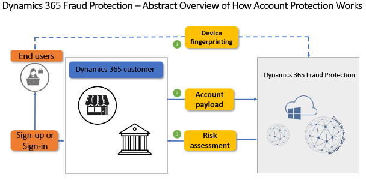
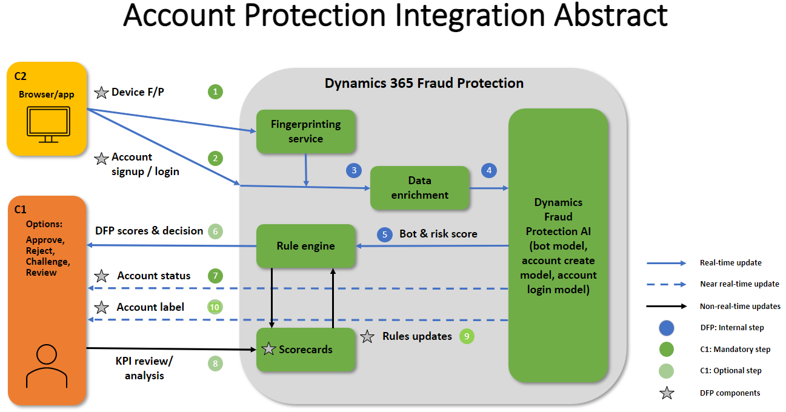

# How account protection works

This article describes how Microsoft Dynamics 365 Fraud Protection account protection works.

Dynamics 365 Fraud Protection provides clients with the capability to assess if attempts to create new accounts and attempts to sign in to a client's ecosystem are fraudulent. Clients can use Fraud Protection risk assessment to block or challenge suspicious attempts to create new fake accounts or to compromise existing accounts. 

The following illustration highlights some of Fraud Protection's capabilities and application programming interfaces (APIs) to help you better understand risk assessment interactions.

- **Device fingerprinting (1)** - Device fingerprinting lets you collect crucial device telemetry during online actions. This information includes hardware information, browser information, geographic information, and the Internet Protocol (IP) address used. This feature is based on artificial intelligence (AI) and can be used as input to the fraud assessments process. A Java-based web software development kit (SDK) is available, as are iOS, Android, and React Native SDKs for mobile applications.
- **Account payload (2)** - Information related to the account creation or account sign-in that clients pass along to Fraud Protection. This data is compared to data already within the Fraud Protection network, where the machine learning model analyzes the data for linkages. 
- **Risk assessment (3)** - The machine learning model can return a score to you for bot and risk scores. The scoring advises you of the probability of fraud risk, or the likelihood of possible fraud that you may want to review or reject.  

## Required APIs and components
 
 The following APIs and components are required to take advantage of Fraud Protection account protection's features.

- **Device fingerprinting** - Device fingerprinting lets you collect crucial device telemetry during online actions. This information includes hardware information, browser information, geographic information, and the IP address. This feature is based on artificial intelligence (AI) and can be used as input to the process of fraud assessments. A Java-based web SDK and iOS, Android and React Native SDKs for mobile applications are available.

- **Account creation and/or account sign-in API** - This API passes data attributes related to the account creation or account sign-in from clients to Fraud Protection. This data is compared to data already within the fraud protection network, where machine learning will search for linkages. 

- **Rules or policies** - You can use the predefined rules in the account protection solution, or you can set up custom rules based on your policies. Rule scoring can tell you the probability of fraud risk, or the likelihood of fraud that you may want to review or reject. 

- **Account status API** - This API is used to inform Fraud Protection of a client's final decision on a transaction. For example, did a sign-in transaction actually happen or was it rejected (and for what reason)? Fraud Protection adapts and learns from client fraud patterns. 

- **Account label API** - This API enables you to send information for model training to Fraud Protection, in addition to the data that informs the virtual fraud analyst and scorecard features.

## How Fraud Protection account protection connects with clients

The following illustration shows how Fraud Protection account protection typically connects with clients. For example, at which stage of the process does an API call take place, which API is called, and which Dynamics 365 components return information to clients.

The numbered elements in the illustration are further explained below the diagram.

**Device fingerprinting (1), front end** - Fraud Protection's device fingerprinting feature is based on artificial intelligence (AI), and device identification can be used as input to the fraud assessment process. This feature helps Fraud Protection track and link unrelated events in the fraud network to help identify patterns of fraud. The data collected isn't just a static list of attributes but also includes dynamically captured data based on the evaluation of specific combinations of attributes such as browser, system, network, and geolocation coordinates. When device characteristics and attributes are collected, the device fingerprinting service uses machine learning to probabilistically identify the device. For example, when a user enters their credentials, the device fingerprinting service does an authentication pass to help determine that the user credentials are correct. Device fingerprinting runs on Azure, and includes benefits from proven cloud scalability, reliability, and enterprise-grade security. Clients and PSPs have control of their user experience (UX) and systems and can decide to implement Fraud Protection's device fingerprinting service on the front-end.  

**Account sign up or account sign-in API (2)** - The first API call happens at this stage. However, device fingerprinting is technically the first time you're communicating with Fraud Protection account protection. There's a common link between device fingerprinting and the account sign up or account sign-in API calls. For example, when you initiate device fingerprinting, you create a unique device context ID that you include when you make the second API call. 

**Data enrichment (3)** - Data enrichment helps connect device fingerprinting, account sign up, and account sign-in. Fraud Protection account protection does some data enrichment before running the data attributes through the bot, account creation, and account sign-in models. 

**Dynamics Fraud Protection AI model (4, 5)** - Within a few milliseconds of the data attributes passing through the AI models, a response is processed by Fraud Protection rules and decisions. Fraud Protection then provides a bot and risk score (5, back end) in the response based on the machine learning scores. 

**Rules engine (6)** - The output of the scores and decisions is dependent on the client policies set in the Fraud Protection rules engine. The scores provided are based on a risk or bot scale, with a lower score indicating less fraud, and a higher score indicating the likelihood of fraud. There are four decisions that you can make: approve, reject, challenge, or review. A challenge decision indicates that you should possibly implement a capture or some other type of verification challenge. A review decision typically indicates that you should do a manual review. The decisions are recommendations from Fraud Protection that are based on the policies that have been configured in the rules engine. It's up to you what rules or decisions you want to set up or activate.

**Account sign-in or account creation status API (7)** - Fraud Protection wants to know what final status decision you made on the account attempt. For example, did you approve or reject the attempt? The account status that you send back to Fraud Protection helps ensure that the correct information is considered by machine learning going forward. 

**Scorecards (8)** - Transactions that come through from clients to Fraud Protection also make their way into scorecard dashboards. The scorecard dashboard isn't updated in real time, but updates every few minutes to show you the aggregated data and trends that Fraud Protection has received. 

**Rules updates (9)** - You may decide that you need to update some of your rules or policies. For example, a member of your team reviews the scorecard dashboards, and you decide to update rules or policies based on what you see in those scorecards.  

**Label API (10)** - The label API enables you to send additional information to Fraud Protection about account sign-in attempts, instrument details, and reversals, in addition to the data that informs the virtual fraud analyst and scorecard features. The labels API provides knowledge for model training based on a set of fraud signals. 

