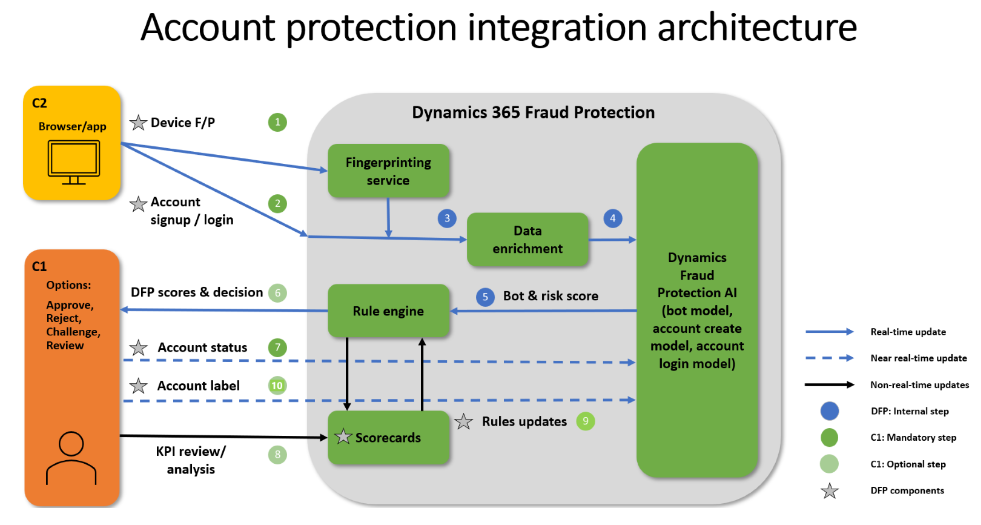

author: cschlegel2
description: This article is a visual abstract of how Dyanmics 365 Fraud Protection Account Protection Works
ms.author: cschlege2
ms.date: 10/17/2022
ms.topic: reference
search.app: 
  - Capaedac-fraudprotection
search.audienceType:
  - Admin
  - IT Pro
title: Abstract Diagram of How Dynamics 365 Fraud Protection - Account Protection Works
ms.custom:

This article provides visual abstract representation and description of how Microsoft Dynamics 365 Fraud Protection – Account Protection interacts with our customers to support their users. Microsoft Dynamics 365 Fraud Protection provides merchants the capability to assess if the risk of attempts to create new accounts and attempts to log in on merchant’s ecosystem are fraudulent. Risk assessment in Fraud Protection can be used by the customer to block or challenge suspicious attempts to create new fake accounts or to compromise existing accounts. The diagram below highlights some of the product capabilities and APIs (Application Programming Interfaces) to help you better understand these interactions. Particularly for Account Create and Account Login scenarios.

- **1.Device Fingerprinting:** Device fingerprinting lets you collect crucial device telemetry during online actions. This information includes hardware information, browser information, geographic information, and the Internet Protocol (IP) address. This feature is based on artificial intelligence (AI) and can be used as input to the process of fraud assessments. A Java-based web SDK (software development kits) and iOS, Android and React Native SDKs for mobile applications are available.

- **2.Account Payload:** Information our customers pass along to Dynamics Fraud Protection related to the Account Creation or Account Login. This data is then compared to data already within our fraud protection network where our machine learning will look for linkages. 

- **3.Risk Assessment:** The machine learning model can then return a score to you for bot and risk scores. The scoring can tell you the probability of fraud risk, or the likelihood of possible fraud that you may want to review or reject.  

At elevated level this is how Dynamics 365 Fraud Protection works for Account Protection.  

On the left-hand side. You can see these are the Dynamics 365 Fraud Protection customers and our merchant’s customers. For example, if an end user is creating a new account or logging into an existing account, the merchant or PSP (Payment Service Provider) can add Dynamics Fraud Protection’s device fingerprinting **(number 1 and 2)** in their UI (user interfaces), so that when someone is interacting to access a website, we are collecting device forensics. We then assign a unique device ID to the session to help identify whenever the user completes some specific event such as an account creation or account login attempt.   

When a new account is created or if an account login takes place, there is an API from Dynamics 365 Fraud Protection side that is being called with specific information, to then pass along to Dynamics 365 Fraud Protection **(number 2)**. Then that data is compared to the data already within our fraud protection network. Our machine learning will then try to find linkages and see past behavior coming from data attributes such as IP address, geo location, email address, phone number, and other system information. There are many other device fingerprinting attributes, as well as other data attributes related to the activity of the entities within the transaction such as velocities or the timing of login attempts. For example, how frequently are we seeing some activity coming from the same account; and then these data attributes that are sent through machine learning analysis to enable us to then return a fraud risk score to you. 

Then on top of the machine learning analysis, there are some simple predefined rules that  Dynamics 365 Fraud Protection customers can set up or you can set up your own custom rules, which would give a response back to you saying the probability the login transaction is fraudulent, with this kind of fraud risk or bot score, and along with the reason for the decision that was made.    

As you can see in **(number 3)**, Risk Assessment. These device attributes go into the Dynamics 365 Fraud Protection machine learning model with which we then return a score to you for bot and risk scores. The scoring is important because it tells you the probability of fraud risk, or the likelihood of fraud that you may want to consider reviewing or rejecting. The lower the score, the less likelihood of fraud and the higher the score, the greater probability of fraud.  

**API Abstract Diagram** - Below is an abstract diagram of how Microsoft Dynamics 365 Fraud Account Protection typically connects with our customer’s front and back end. For example, at what time in the process does and API call take place, to which API, and what Microsoft Dynamics 365 components would then return to our customers. 

 

 **Microsoft Dynamics 365 Fraud Protection Customers Will Need to Set Up these APIs or Components:** 

- **Device Fingerprinting:** Device fingerprinting lets you collect crucial device telemetry during online actions. This information includes hardware information, browser information, geographic information, and the Internet Protocol (IP) address. This feature is based on artificial intelligence (AI) and can be used as input to the process of fraud assessments. A Java-based web SDK and iOS, Android and React Native SDKs for mobile applications are available.

- **Account Creation and/or Account Login API:** Data attributes our customers pass along to Dynamics Fraud Protection related to the Account Creation or Account Login. This data is compared to data already within our fraud protection network where our machine learning will look for linkages. 

- **Rules or Policies:** There are predefined rules in the Account Protection solution, or you can set up custom rules based on your policies. The rule scoring can tell you the probability of fraud risk, or the likelihood of fraud that you may want to review or reject. 

- **Account Status API:** Is used to inform Dynamics Fraud Protection of the merchant’s final decision on a transaction.  For example, did the login transaction actually happen or was it rejected for what reason.  It is important to let Dynamics Fraud Protection adapt and learn from the merchant’s fraud patterns. 

- **Account Label API:** Enables you to send additional information to Dynamics Fraud Protection in addition to the data that informs the virtual fraud analyst and scorecard features. The labels API provides additional knowledge for model training based on an additional set of fraud signals.
