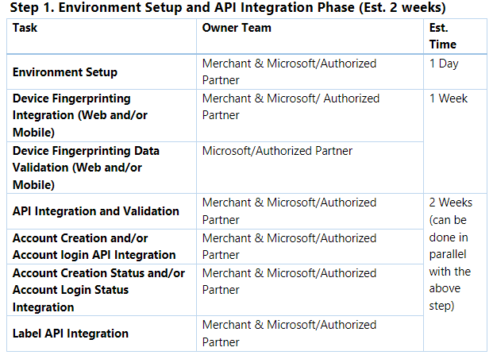
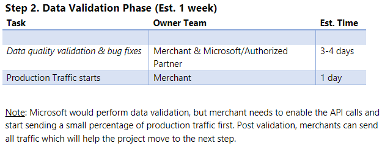

author: cschlegel2
description: This article explains Dynamics 365 Fraud Protection - Account Protection Onboarding Planning Guide
ms.author: cschlege2
ms.date: 10/12/2022
ms.topic: reference
search.app: 
  - Capaedac-fraudprotection
search.audienceType:
  - Admin
  - IT Pro
title: Onboarding Planning Guide for Purchase Protection
ms.custom:

**Integration Planning Guide:** This guide helps you understand and plan for the project milestones of Dynamics 365 Fraud Protection Account Protection integration and onboarding. To understand the integration steps below in more detail, please review the integration guide:  [set up purchase protection](https://learn.microsoft.com/dynamics365/fraud-protection/promocode-set-up-purchase-protection)

**Onboarding Milestones - Integration Breakdown and Approximate Time** 

**Note:** All timeframes below are estimates. Actual time taken can vary based on Merchant, and Microsoft/Authorized Partner availability and focus. 

