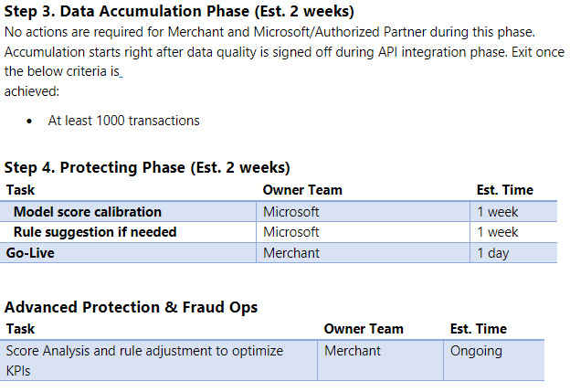

# Onboarding planning for purchase protection

This article describes onboarding planning for purchase protection in Microsoft Dynamics 365 Fraud Protection.

**Integration Planning Guide:** 

This guide helps you understand and plan for the project milestones of Dynamics 365 Fraud Protection Account Protection integration and onboarding. For more details on the integration steps below, see [Set up purchase protection](promocode-set-up-purchase-protection.md).

## Onboarding milestones - integration breakdown and approximate times 

> [!NOTE]
> All timeframes mentioned in this article are estimates. The actual time taken can vary based on merchant, Microsoft and authorized partner availability, and focus. 

## Resources 

The following resources provide more details on the integration steps referenced above.

- [Dynamics 365 Fraud Protection overview](/dynamics365/fraud-protection/)
- [Create and provision your Azure tenant](promocode-set-up-dfp-purchased-version.md)
- [Set up a trial instance of Dynamics 365 Fraud Protection](promocode-set-up-dfp-trial-version.md)
- [Set up a purchased instance](promocode-set-up-dfp-purchased-version.md)
- [Configure user access and assign roles](configure-user-access.md)
- [Set up account protection](promocode-set-up-account-protection.md)
- [Configure Dynamics Fraud Protection with Azure Active Directory B2C](/azure/active-directory-b2c/partner-dynamics-365-fraud-protection)
- [Set up device fingerprinting](device-fingerprinting.md)
- [integrate account protection APIs](integrate-ap-api.md)
- [Integrate purchase APIs schema documentation](https://dfpswagger.azurewebsites.net/index.html)
- [Integration training modules](/training/paths/deploy-work-account-purchase-protection/)
- [Account protection manage lists and rules](rules.md)
- [Account protection schemas](ap-schema.md)
- [Account protection threat vulnerability analyzer tool](threat-vulnerability-analyzer.md)
