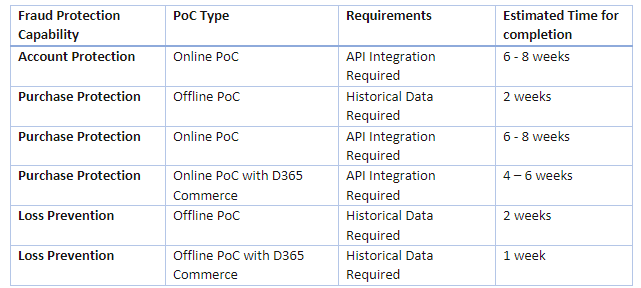

# Evaluate proof of concept options

This article explains how to evaluate proof of concept (POC) options in Microsoft Dynamics 365 Fraud Protection.

Fraud Protection lets you evaluate a POC to determine whether a proposed fraud solution can meet your business needs. The POC includes a free 90-day Fraud Protection trial that you can assess before you make a purchase decision.

## Prerequisites

- To participate in a Fraud Protection POC, you must have a Microsoft Entra tenant. If you don't already have an Microsoft Entra tenant, you can sign up for one.
- Before you can start a Fraud Protection POC, Microsoft or a Microsoft authorized partner must provide a promotion code to you. If you don't have a promotion code, see [Get started with Fraud Protection](https://dynamics.microsoft.com/get-started/?appname=fraudprotection) to contact a partner and request one.

## Fraud Protection POC capabilities 

The following table lists the Fraud Protection POC capabilities and their POC types, requirements, and estimated times for completion.

| Fraud Protection capability | POC type | Requirements | Estimated time for completion |
|---|---|---|---|
| [Account protection](#account-protection-online-poc) | Online POC | API integration | Six to eight weeks |
| [Purchase protection](#purchase-protection-offline-poc) | Offline POC | Historical data | Two weeks |
| [Purchase protection](#purchase-protection-online-poc) | Online POC | API integration | Six to eight weeks |
| [Purchase protection](#purchase-protection-dynamics-365-commerce-and-fraud-protection-online-poc) | Online POC with Dynamics 365 Commerce | API integration | Four to six weeks |
| [Loss prevention](#loss-prevention-offline-poc) | Offline POC | Historical data | Two weeks |
| [Loss prevention](#loss-prevention-dynamics-365-commerce-and-fraud-protection-offline-poc) | Offline POC with Dynamics 365 Commerce | Historical data | One week |

<!---->

## POC examples

This section provides examples that show how to participate in different POC trials, depending on the Fraud Protection solution that you're interested in exploring.

### Account protection (online POC)

The account protection online POC requires API integration to set up the account protection solution for account creation, account sign-in, or both. This POC provides an authentic experience that provides the most accurate results. It typically takes about six weeks to obtain results, depending on your integration speed. This POC will help you gain a thorough understanding of Fraud Protections artificial intelligence (AI), robust features, and reporting dashboards. You can also learn how the solution will address your specific fraud challenges in the product portal, and how your team and customers might be able to interact with the solution. If you decide to purchase the solution, it will already be set up for you to use.

> [!NOTE]
> Account protection has only the online POC option.

### Purchase protection (offline POC)

The purchase protection offline POC is the fastest way to understand purchase protection. Results are typically obtained in two weeks, depending on the data quality. To use this POC, you must provide a minimum of three months of transaction data to Fraud Protection. Two months of this data must have chargebacks/labels, and the third month of data must have just transaction details. The Fraud Protection team will then run the data through machine learning models and return a presentation, together with supporting files. This presentation will show the results that are related to your fraud risk scenarios. Offline POC results are guidelines about what you can expect from real-life results. Actual results might differ because of additional fraud signals that are captured (such as device fingerprinting). They're also influenced by the latest fraud trends.

### Purchase protection (online POC)

The purchase protection online POC resembles the [account protection online POC](#account-protection-online-poc), where API integration is required. This online POC typically takes about six to eight weeks to obtain results, depending on the pace of your integration and the quality of the data that you provide. This POC will help you gain a thorough understanding of the innovative AI, robust features, and reporting dashboards. You can also learn how the solution will address your specific fraud challenges in the product portal, and how your team and customers might be able to interact with the solution.

### Purchase protection (Dynamics 365 Commerce and Fraud Protection online POC)

If you're an existing Dynamics 365 Commerce customer, the connection between Commerce and Fraud Protection gives you a head start in the process of running a purchase protection online POC. The process is faster than it is for a typical online POC, and some of the required Fraud Protection API integrations can be done through just a few configuration changes in Commerce. To get started, Commerce customers can go to the Fraud Protection portal to set up Fraud Protection. For more information about how to get started, see [Set up a purchased instance](promocode-set-up-dfp-purchased-version.md).

### Loss prevention (Offline POC)

The loss prevention offline POC requires that you map historical data and upload it to the Fraud Protection portal. The Fraud Protection team can then work with you to help you understand the results of your data. It can also give you guidance about how to use the loss prevention offline POC solution to address specific challenges that are related to potential fraud risk scenarios.

### Loss prevention (Dynamics 365 Commerce and Fraud Protection offline POC)

If you're an existing Commerce customer, you can easily import your data and generate loss prevention reports from the Fraud Protection portal. The Fraud Protection team can then work with you to help you understand the results of your data. It can also give you guidance about how to use the loss prevention offline POC solution to address specific challenges that are related to potential fraud risk scenarios. To get started, see [Loss prevention in Commerce](/dynamics365/commerce/dev-itpro/dfp#loss-prevention-in-commerce).
