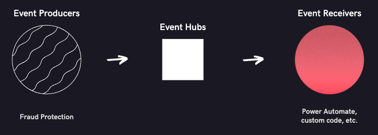

# Set up extensibility via Event Hubs

[!include[deprecation](includes/deprecation.md)]

> [!NOTE]
> This article provides text-based instructions and links to relevant information. If you prefer a visual video format, watch the [setup tutorial series](https://vimeo.com/showcase/7308527).

To get started, you must set up the following items:

- A [resource group](/azure/azure-resource-manager/management/manage-resource-groups-portal)
- A [Microsoft Azure Event Hubs namespace and an event hub](/azure/event-hubs/event-hubs-create)
- An [event tracing subscription in Microsoft Dynamics 365 Fraud Protection](./event-tracing.md)
	
> [!NOTE]
> We recommend that you set up a *separate* event hub for the subscription for each event *type*. For example, you can set up an **audit-events** event hub that has a Fraud Protection event tracing subscription to send *audit events*. Then set up a **latency-events** event hub that has a separate subscription to send *latency events*. You can set up both event hubs under the same namespace.

After you complete the setup that is described in this article, you will have the basics that are required to work with Fraud Protection event data. The following data flow is also set up.

Fraud Protection produces real-time events and sends them to your Event Hubs instance. They are then consumed by event receivers such as Power Automate, Logic Apps, etc.

To work with these events from Event Hubs, you can use either code via software development kits (SDKs) or Microsoft Power Platform tools.

## Related articles

- [Extensibility via Event Hubs](extensibility-via-event-hubs-overview.md)
- [Work with code](extensibility-with-code.md)
- [Work with Logic Apps or Power Automate](extensibility-with-power-automate.md)
- [Work with Power BI](extensibility-with-power-bi.md)
- [Work with Power Apps](extensibility-with-power-apps.md)

[!INCLUDE[footer-include](includes/footer-banner.md)]
