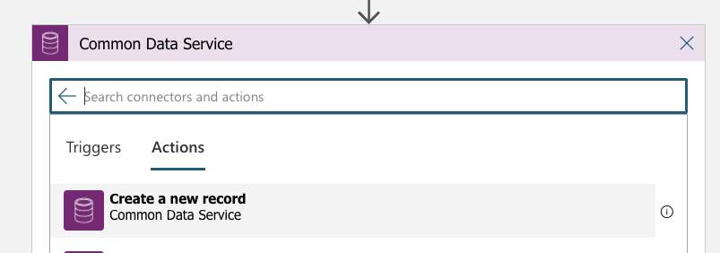
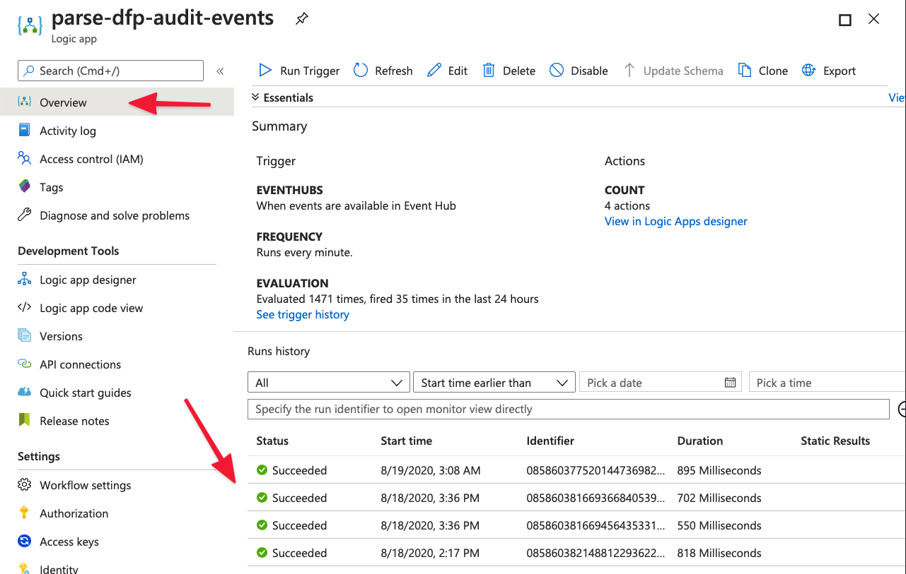

# Work with Logic Apps or Power Automate

[!include[deprecation](includes/deprecation.md)]

Microsoft Azure Logic Apps and Power Automate flows offer low-code user interfaces (UIs) for building automated processes. Both types of flow include hundreds of built-in connectors (such as connectors for Teams and Outlook) for fast development.

For example, these flows are excellent for automatically sending an email when a specific user's rule has been deleted or pinging a Teams channel when high latency is detected.

> [!NOTE]
> Logic Apps is used for this article. However, similar, if not identical, logic can be applied to Power Automate flows. Logic Apps is part of the Azure portal, whereas Power Automate is a separate product that is part of the Microsoft Power Platform family of tools. Pricing and capabilities vary. 

## Getting started

Microsoft Dynamics 365 Fraud Protection offers many types of events that you can receive and work with through Logic Apps.

To accelerate the setup process, go to [this GitHub repository (repo)](https://github.com/microsoft/Dynamics-365-Fraud-Protection-Samples/tree/master/logic%20app%20templates). This repo contains Logic App templates that will parse the event data for you. Therefore, you can immediately start to interact with the data. Follow the setup and usage instructions in the readme file that is provided in the repo.

## Storing event data in the Common Data Service database (optional)

By storing event data in Common Data Service as it comes through your event hub, you have a centralized database store that Power BI, Power Apps, and other Logic Apps or Power Automate flows can use.

> [!NOTE]
> If you want to use either the sample app that is mentioned in [Work with Power Apps](extensibility-with-power-apps.md) or the sample Power BI report that is mentioned in [Work with Power BI](extensibility-with-power-bi.md), set up your Common Data Service entities by importing the pre-built solutions instead of manually creating the entities yourself.

1. [Create an entity in Common Data Service](/powerapps/maker/common-data-service/data-platform-create-entity).

    For example, if you're working with audit events, you might create an entity that is named **Audit Event**, and that has fields that are named **Entity Name**, **Entity Type**, **Operation Name**, **Timestamp**, and **User ID**. (For information about fields, see [How to create and edit fields](/powerapps/maker/common-data-service/create-edit-fields).)

    Nevertheless, you can set up your entity however you want, based on the information and naming conventions that you want. We recommend that you have a *separate* Common Data Service entity for each type of Fraud Protection event that you want to use.

2. In your logic app, add a new step, and then find and select **Create a new record**.

    Note that, if you used the templates from the GitHub repo, your logic app should already include some steps, such as **ParseContent**, **GetEvent**, and **ParseEvent**.

    

4. Select your environment and the entity name. The information that you enter in the **Environment** field must be specific to your own setup.
5. Set the parameters that you want to store. Use the dynamic data fields from the previous step, **ParseEvent**.

   Note that you might have to select **See More** when you load in dynamic content.

6. Confirm that your logic app is running correctly. In the left navigation, select **Overview**, and then select **Runs history**.

    

7. Confirm that event data is being stored correctly in Common Data Service. In [Power Apps](https://make.preview.powerapps.com/), look in the **Data** section of your entity. Be sure to switch the view to **Custom fields**.

You now have a constantly updated database in Common Data Service that contains your event data. Therefore, you can now interact with this database through Microsoft Power Platform tools such as Power BI and Power Apps.

## Related articles

- [Extensibility via Event Hubs](extensibility-via-event-hubs-overview.md)
- [Set up extensibility via Event Hubs](extensibility-setup.md)	
- [Work with code](extensibility-with-code.md)
- [Work with Power BI](extensibility-with-power-bi.md)
- [Work with Power Apps](extensibility-with-power-apps.md)

[!INCLUDE[footer-include](includes/footer-banner.md)]
