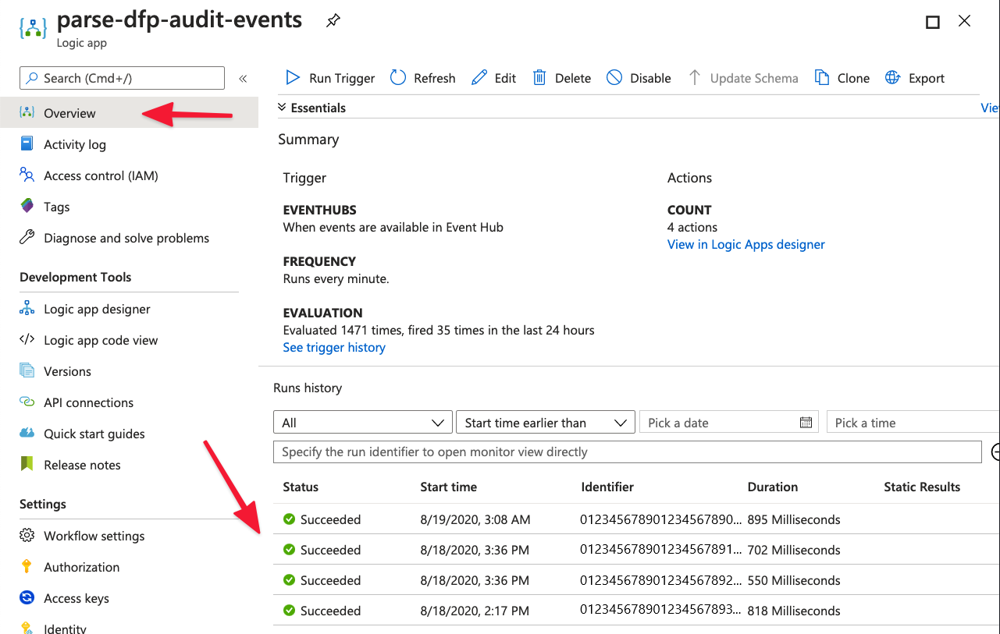

# Working with Logic Apps / Power Automate

**Logic Apps** and **Power Automate** flows offer low-code user interfaces for building automated processes. Both flows include hundreds of built-in connectors (including Microsoft Teams, Outlook, etc.) for fast development.

As examples, these are excellent for automatically sending out an email when a certain user’s rule has been deleted or for pinging a Microsoft Teams channel when a high latency is detected.

> [!NOTE]  
>  We're using **Logic Apps** for this tutorial but similar, if not identical, logic can be applied to **Power Automate** flows. **Logic Apps** is a part of the Azure portal, whereas **Power Automate** is a separate product that is part of the **Power Platform** family of tools. Pricing and capabilities vary, so refer to the [Pricing](extensibility-pricing.md) section at the end of this page for more information.  

### Getting started

Fraud Protection offers many types of events that you can receive and work with through **Logic Apps**. 
To accelerate this setup process, go to [this GitHub repository](https://github.com/microsoft/Dynamics-365-Fraud-Protection-Samples/tree/master/logic%20app%20templates). This repository contains **Logic App** templates that handle the parsing of this event data for you, so you can start interacting with the data immediately.  Follow the setup and usage instructions in the `readme` file located in that repository.

### Storing event data in the Common Data Service (CDS) database (optional)

Storing event data in **CDS** as they come through your event hub is a great way to have a centralized database store of your data that can be used by **Power BI**, **Power Apps**, and other **Logic Apps/Power Automate** flows.

> [!NOTE]  
>  If you want to use the sample Power App in the [Working with Power Apps](extensibility-with-power-apps.md) section or the Power BI report in the [Working with Power BI](extensibility-with-power-bi.md) section, setup your CDS entities by importing the pre-built solutions rather than by manually creating them yourself.   

1. Start by [creating an entity within CDS](https://docs.microsoft.com/powerapps/maker/common-data-service/data-platform-create-entity). 

   As an example, if you are working with **Audit Events**, create an entity called `Audit Event` with fields named `Entity Name`, `Entity Type`, `Operation Name`, `Timestamp`, `User ID`. (For information on fields, see [How to create and edit fields](https://docs.microsoft.com/powerapps/maker/common-data-service/create-edit-fields).)
   
   That said, you can setup your entity however you like, based on the information and naming conventions you want. It is suggested you have a *separate* CDS entity for each Fraud Protection event type that you want to use.
   
2. In your **Logic App**, add a **New Step** and find **Create a new record**.  

   Note that if you used our provided templates, your **Logic App** should have some steps already included, for example, `ParseContent`, `GetEvent`, and `ParseEvent`.

4. Select your `Environment` and `Entity Name`.
5. Fill in the parameters you want to store using the dynamic data fields from the previous `ParseEvent` step. The information you enter in the **Environment** field, must be specific to your own setup. For example:
      

  
   Note that you may have to click **See More** when loading in dynamic content.

6. Confirm that your **Logic App** is running properly. In the left navigation, click **Overview**, and then click **Runs history**.

7. Confirm that event data is being stored in CDS properly. Check the **Data** section of your entity inside the [Power Apps Portal](https://make.preview.powerapps.com/). Be sure to toggle the view to `Custom fields`.

   Now we have a constantly updated database in CDS with our event data from which we can interact with through Power Platform tools like Power BI or Power Apps. 

## Related topics
- [Extensibility via Event Hubs -  overview](extensibility-via-event-hubs-overview.md)
- [Setup extensibility via Event Hubs](extensibility-setup.md)	
- [Working with code](extensibility-with-code.md)
- [Working with Power BI](extensibility-with-power-bi.md)
- [Working with Power Apps](extensibility-with-power-apps.md)
- [Pricing](extensibility-pricing.md)
