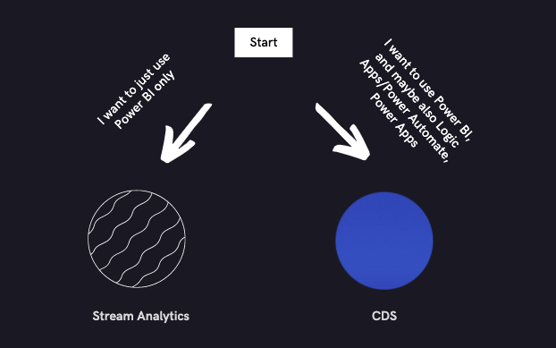

# Work with Power BI

[Microsoft Power BI](/power-bi/) makes the process of working with event data from Microsoft Dynamics 365 Fraud Protection customizable and easy. Power BI lets you produce informative and interactive data visualizations.

## Getting started

To get Fraud Protection event data into Power BI, you can use event data that is inside Common Data Service (CDS). Alternatively, you can configure [Azure Stream Analytics](/azure/stream-analytics/stream-analytics-power-bi-dashboard) to send data directly from Azure Event Hubs into Power BI.

For more information, see the following decision tree.



We recommend: 

- CDS for use with other Power Platform products such as Logic Apps, Power Automate, and Power Apps. 
- Azure Stream Analytics for sending Event Hubs data to only Power BI or Azure-hosted analytics and storage solutions.

For information about how to set up CDS, see [Storing event data in the Common Data Service database (optional)](extensibility-with-power-automate.md#storing-event-data-in-the-common-data-service-database-optional).

### Set up Azure Stream Analytics

1. Go to the [Azure portal](https://portal.azure.com/).
2. In the search field, enter **stream analytics**, and then select **Stream Analytics jobs** in the list of results.
3. Add a new job.
4. Enter the name, subscription, resource group, and other information.
5. Wait until the job has been deployed. Then, in the left navigation, select **Inputs**, select **Add stream input**, and then select **Event Hub**.
6. Enter any name for the input alias, and set up the fields so that they point to the event hub that you want to get data from. For most of these fields, you can select the **Use existing** option. You can leave the remaining fields set to their default value.
7. Select **Save** to create the input.
8. In the left navigation, select **Outputs**, select **Add**, and then select **Power BI**.
9. Authorize the connection.
10. Enter any name for the output alias, and select the group workspace that you want to add the **Power BI** dataset to. You can create a new group workspace in [Power BI](https://msit.powerbi.com/).
11. Name the dataset and table, and then select **Save** to create the output.
12. In the left navigation, select **Query**, and then set up your query, based on the fields of data from the events in your event hub that you want your **Power BI** dataset to include. This query uses SQL syntax.
13. For **FROM**, select the input entity that you set up earlier. For **INTO**, select the output entity that you set up.
14. Select **Select time range**, and then load sample events that have gone through your event hub. Make sure that the start time is far enough in the past so that you can see some events loaded.

    The following sample query for audit events will let you construct a table that has the desired values.

    ```Javascript
    SELECT
        audit.entityName,
        audit.entityType,
        audit.operationName,
        audit.userId
    INTO
        [PBIAudit]
    FROM
        [EHAudit]
    ```

    In this query, **PBIAudit** is the name of the output entity that was set up earlier, and **EHAudit** is the name of the input entity.

16. In [Power BI](https://msit.powerbi.com/), check your Power BI workspace to confirm that your dataset has been made, and that is contains the information that you intended to get.

## Creating Power BI reports

The following resources will help you start to produce your own Power BI reports:

- [Power BI beginner tutorial](https://www.youtube.com/watch?v=AGrl-H87pRU)
- [Official Power BI documentation](/powerapps/maker/common-data-service/data-platform-powerbi-connector)
- [Building Power BI reports for the Common Data Service for Apps](https://powerapps.microsoft.com/blog/cds-for-apps-powerbi/)

## Sample Power BI reports

You can reference and build a sample of a Power BI dashboard that is based on Fraud Protection latency event data in [this GitHub repository (repo)](https://github.com/microsoft/Dynamics-365-Fraud-Protection-Samples/tree/master/power%20bi%20sample).

## Related articles

- [Extensibility via Event Hubs](extensibility-via-event-hubs-overview.md)
- [Set up extensibility via Event Hubs](extensibility-setup.md)	
- [Work with code](extensibility-with-code.md)
- [Work with Logic Apps or Power Automate](extensibility-with-power-automate.md)
- [Work with Power Apps](extensibility-with-power-apps.md)


[!INCLUDE[footer-include](includes/footer-banner.md)]
