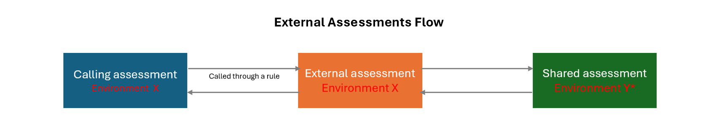

# External assessments

External assessment is a mechanism to call an assessment from any other assessment. An external assessment isn't an assessment itself. Instead, it acts like a data source which allows you to send data and receive a response from a target assessment. 
An assessment can have one of two possible sharing settings:
- Private: Accessible only in assessment’s root environment.
- Shared: Accessible in all environments in the tenant.

External assessments can point to any **Private** assessment that's available in the same root environment, or any **Shared** assessment that's available in any root environment of the tenant. 

> [!NOTE]
> For more information about how to change the **Sharing** setting of an assessment from _Private_ to _Shared_ or _Shared_ to _Private_, refer to [Assessment configuration overview](assessment-configure-existing.md).

After you set up an external assessment, it can be called through a rule from any assessment in that environment. 



*For Private Assessment: Environment Y = Environment X*

*For Shared Assessment: Environment Y = Any root environment within the same tenant*

A calling assessment refers to any assessment that calls a private or shared assessment through an external assessment. The calling assessment must have an external assessment rule set up. When the rule condition is met, the rule will call the external assessment and perform the configured actions. Similar to external calls, external assessments aren't inherited by children. To use an external assessment in a rule, you must set up the external assessment in the environment you want to call it from.  

## Create an external assessment

To create an external assessment, first ensure you have the right permission to perform this operation. For more information about user roles and permissions, see [User roles and access](user-roles-access.md)

1.	In the Fraud Protection portal, in the left navigation, select **External Assessments**, and then select **+ New external assessment**.
2.	On the **New external assessment** page, set the following fields:
  - **Target assessment to call** – In the drop-down you can see all the private assessments, set up in the same root environment, as well as any available shared assessments, set up in any root environment of the same tenant. Select the assessment you want to target.

  > [!NOTE]
  > If the shared assessment you want to point your external assessment to is not showing in the drop-down, then check the **Sharing** setting of the assessment and ensure it is set to **Shared**. To learn more on how to configure the **Sharing** setting, refer to [Assessment configuration overview](assessment-configure-existing.md).

  - **Name** – Enter the name that you will use to reference the external assessment from your rules. The name can contain only numbers, letters, and underscores. It can't begin with a number.

  > [!NOTE]
  > You can't change the name of an external assessment after you use it in a rule.

  - **Description** – Add a description to help your team quickly identify the external assessment.
  - **API to preview** – Select the API you want to preview the sample code for. The sample code is the FQL you can use in a rule to call this shared assessment

  > [!NOTE]
  > You can use the external assessment to call the evaluate, observation, or label API of the shared or private assessment it points to. 

  - **Sample response** – This section contains the sample response expected from the target assessment. The information displayed is manually provided by the target assessment admin, and is used to enable descriptions (tooltips) and suggestions for autocomplete when the assessment is referenced in a rule.
3.	When you're done setting the required fields, select **Create**.

## Call an external assessment

To use your external assessments, reference them from your rules. For example, to reference an external assessment, named **myAssessment**, in your rule use the following syntax:

```FraudProtectionLanguage
Assessments.myAssessment.Evaluate($baseInput = @@)
```

In the above example, ```$baseInput = @@```will map all fields needed by the shared/external assessment from the calling assessment’s payload. You can map specific fields only as well. You can also define what actions you want the rule to take based on the information it will receive back from the External assessment call.

For example,

```FraudProtectionLanguage
LET $card = {
  number: 12345,
  expy: "2023-03-10".ToDateTime()
}
LET $response = Assessments.MicroTx.evaluate(card = $card, user = @@"user")
OBSERVE Output(decision = $response.decisionDetails.merchantRuleDecision)

```
You can set up a rule to call the external assessment by either using the *Use an external assessment* rule template or copy/paste the sample FQL from the external assessment page. Be sure to use the sample code for the API (evaluate, observe, label) you want to call. The sample code will show all the fields that can be sent to the shared assessment. The required fields are marked as such in the code. 

Here is another sample FQL for calling the evaluate API of external assessment named **ExtAssessment1**:

```FraudProtectionLanguage
LET $customUser = {
    id: "userId123456",
    username: "johnsmith2",
    firstName: "John",
    lastName: "Smith",
    email: "johnsmith2@gmail.com",
    address: {
        street1: "0123 Bechtelar Loop",
        city: "Kubtown",
        state: "SC",
        zipCode: "44329",
        countryRegion: "US"
    }
}

LET $result = Assessments.ExtAssessment1.Evaluate(
    user = $customUser,
    specialConsideration = true)
OBSERVE Output(Result = $result)
```

You can also access the diagnostics object in rules, which allows you to discover important diagnostic and debug information from an external assessment's response. The diagnostics object contains the *Request* payload, *HttpStatus* code, error message, and latency. The diagnostics object must be created first by using its corresponding extension method, “.GetDiagnostics()”, before the object’s fields can be used in the rules. 

The following is an example of a rule using the diagnostics object on the response of an external assessment named **ExtAssessment2**:
```FraudProtectionLanguage
LET $result = Assessments.ExtAssessment2.evaluate($baseInput =@@)
LET $diagnostics = $result.GetDiagnostics()
RETURN Approve(), Output (Diagnostics = $diagnostics)
WHEN $diagnostics.httpStatusCode==200
```

External calls and external assessments may require complex structured objects as part of their request schema. For more information on how to use JSON arrays and objects, refer to the [Language reference guide](fpl-lang-ref.md). 

> [!NOTE]
>
> External Assessments can also be referenced within Functions. For more information, see [Functions](Functions.md).

## Monitor external calls in the Fraud Protection portal

Fraud Protection shows a tile that contains three metrics for each external assessment that you define:
- **Requests per second** – The total number of requests divided by the total number of minutes in the selected time frame.
- **Average latency** – The total number of requests divided by the total number of minutes in the selected time frame.
- **Success rate** – The total number of successful requests divided by the total number of requests that were made.

The numbers and charts that are shown on this tile include only data for the time frame that you select in the drop-down list in the upper-right corner of the page.

> [!NOTE]
> Metrics are shown only when your external assessment is used in an active rule.

- To dive deeper into the data about your external assessment, select Performance in the right corner of the tile.
Fraud Protection shows a new page that has a more detailed view of the metrics.
- To view metrics for any time frame in the last three months, adjust the Date range setting at the top of the page.

In addition to the three metrics that were described earlier, an **Error** chart is also shown. This chart shows the number of errors by error type and code. To view error count over time, or to view the distribution of errors, select **Pie chart**.

In addition to HTTP client errors (400, 401, and 403), you might see the following errors:

- **Invalid application ID** – The application ID that was provided doesn't exist in your tenant, or it isn't valid.
- **Microsoft Entra failure** – The Microsoft Entra token could not be retrieved.
- **Definition not found** – The external call was deleted, but it's still referenced in a rule.
- **Timeout** – The request to the target took longer than the specified time-out.
- **Communication failure** – No connection could be made to the target because of a network issue or because the target is unavailable.
- **Circuit breaker** – If the external call failed continuously and exceeded a certain threshold, all further calls are suspended for a short interval.
- **Unknown Failure** – An internal Dynamics 365 failure occurred.


[!INCLUDE[footer-include](includes/footer-banner.md)]
