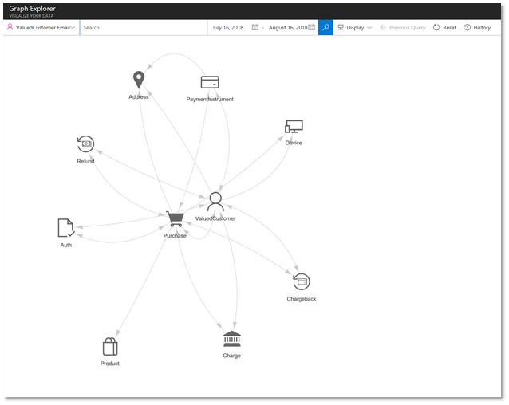
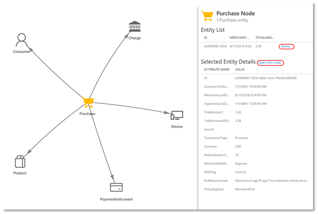

# Visually explore your data

The graph explorer in Microsoft Dynamics 365 Fraud Protection enables you to explore your data and navigate to the information you need. Understand the connections between data, search for specific data points, and view their specific attributes. 

## Navigate your ontology

Selecting **Graph explorer** shows the search and filtering options. For your reference, a read-only version of the ontology also displays. To familiarize yourself with the structure, select any category of data, called a *node*, to view its attributes. Related nodes are connected by *edges*, which may have their own properties depending on the nature of the data.  

 
For example, the Purchase node includes attributes like PurchaseId, TotalAmount, and Currency. It is related to other nodes, like the Product being purchased, the User who bought it, and the Payment Instrument they used. 

## Graph data

To find specific data, search using the fields and filters at the top of the screen. For example, searching by User:Email will display users associated with the specified email address. Specify date ranges to narrow your search, and select nodes in your search results to see their attributes.

 
If more than ten instances of a single node type exist, these will be clustered together. Double-click to expand this cluster and reveal the individual nodes.

 
When viewing details about a selected node, you can sort and filter entities and run queries against them. 

 
To access your previous searches, use the **Query history** feature. To re-run any previous search, select **Go to query**.

## Analyze results

Visualizing data in the graph explorer can help familiarize you with typical data relations. For instance, a single user may have multiple legitimate address nodes, such as a billing address and a shipping address, or more than one payment instrument, like a credit card and an electronic payment account. You can also evaluate these connections for signs of possible fraudulent activity. For example, a fraudster may have used a stolen payment instrument to make purchases across several user accounts. Viewing that payment instrument will show all the users connected to it. 

For deeper investigative options, see [Support your customers](customer-support.md). 
