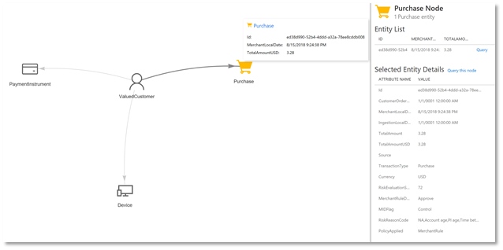
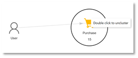

# Graph transactions

The graph explorer in Dynamics 365 Fraud Protection visualizes your data and helps you navigate to the information you need. Explore the ontology of your transactions, see how the properties relate, and view any point for specifics.

## Navigate your ontology

The graph explorer is available under **Data engineering**.

Opening the graph explorer shows the ontology structure. Selecting any category of data, called a *node*, displays its attributes. If your ontology has been edited to give nodes or attributes custom labels, like changing the name of “User” to “ValuedCustomer,” you will see those names here.

Related nodes are connected by *edges*, which may have their own properties depending on the nature of the data. These allow you to navigate through the ontology and understand the connections between data.

 
For example, the Purchase node includes detailed attributes like PurchaseId, TotalAmount, and Currency. It is related to other nodes, like the Product being purchased, the User who bought it, and the Payment Instrument they used. Each of these nodes has their own attributes and will reveal more details about any given transaction.

## Graph transactions

To visualize specific data, search using the fields and filters at the top of the screen. For example, searching by User:Email will show you users associated with the specified email address. Specify date ranges to narrow your search.

Select nodes in your search results to see details. Centering any node will show how many others are linked to it and of what type.

 
If something is related to more than ten instances of a single node type, these will be clustered together. Opening this cluster will reveal the individual objects.

 
When viewing details about a node, you can sort and filter entities and run queries against them. *Query* and *Query this node* re-query the graph data with the selected entity at the center, showing the first-level connections to this data.

 
To access your previous searches, use the **Query history** feature. To re-run any previous search, select **Go to query**.

## Analyze results

Visualizing data in the graph explorer can help familiarize you with typical data relations and can highlight areas of risk. For instance, a single user may have multiple legitimate address nodes, such as a billing address and a shipping address, or more than one payment instrument, like a credit card and an electronic payment account. If unusual patterns emerge, you can investigate those for signs of possible fraudulent activity. For example, a fraudster may have used a stolen payment instrument to make purchases across several user accounts. Viewing that payment instrument will show all the users connected to it. 
