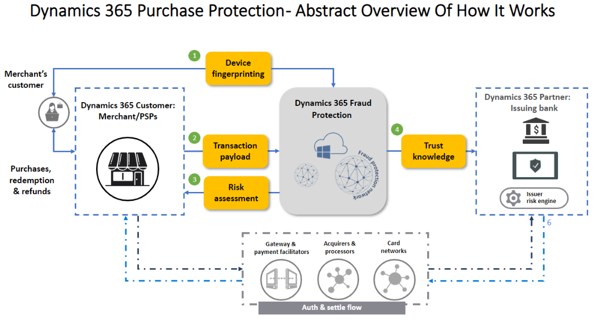
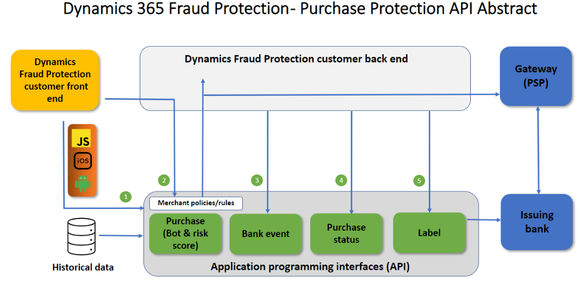

# How purchase protection works 

This article describes how Microsoft Dynamics 365 Fraud Protection purchase protection interacts with different entities, such as customers and banks.

The following illustration highlights some of Fraud Protection's purchase protection capabilities and application programming interfaces (APIs), to help you better understand risk assessment interactions.

Here's an explanation of the numbered elements in the illustration:

- **Device fingerprinting (1)** – Device fingerprinting lets you collect crucial device telemetry during online actions. The data includes hardware information, browser information, geographic information, and the Internet Protocol (IP) address. This feature is based on artificial intelligence (AI) and can be used as input to the fraud assessments process. Device fingerprinting can be deployed for both browser-based and mobile-based applications. A Java-based web software development kit (SDK) is available, as are iOS, Android, and React Native SDKs for mobile applications.
- **Transaction payload (2)** – The transaction payload contains transaction-related information that clients pass to Fraud Protection. This data is compared to data that is already in the Fraud Protection network, where the machine learning model analyzes the data for linkages. 
- **Risk assessment (3)** – Fraud Protection's machine learning model can return a score to you for bot and risk scores. The scoring advises you about the probability of fraud risk, or of the likelihood of possible fraud that you might want to review or reject. 
- **Trust knowledge (transaction acceptance booster) (4)** – This feature helps you benefit from higher acceptance rates by sharing trust knowledge with banks.

> [!NOTE]
> Reason codes are subject to change based on improvements to the Fraud Protection Service by Microsoft. Additionally, reason codes that are associated with a specific transaction may change based on additional information that's obtained and processed by the Fraud Protection Service.

## Required APIs and components

The following APIs and components are required to take advantage of Fraud Protection purchase protection's features:

- **Device fingerprinting (front end)**<!-- – Device fingerprinting lets you collect crucial device telemetry during online actions. The data includes hardware information, browser information, geographic information, and the IP address. This feature is based on AI and can be used as input to the fraud assessments process. It can be deployed for both browser-based and mobile-based applications. A Java-based web SDK is available, as are iOS, Android, and React Native SDKs for mobile applications.-->
- **Purchase API (back end)** – This API collects data attributes that include transaction context. This data is compared to data that's already in the fraud protection network, where machine learning searches for linkages and similarities to known emerging fraud patterns.
- **Bank event API (back end)** – This API is used to inform Fraud Protection of the bank's authorization decision (for example, approval or rejection of the transaction). It can also be used to inform Fraud Protection of related events, such as card verification value (CVV) or 3D Secure (3DS) challenges. 
- **Purchase status API (back end)** – This API is used to inform Fraud Protection of the client's final decision about the transaction. It's important that Fraud Protection be notified whether a transaction was approved or rejected for any reason. In that way, it can adapt and learn from the client's fraud patterns. 
- **Label API (back end)** – This API lets you send additional information to Fraud Protection about transactions, account or payment instrument details, chargebacks, refunds, and reversals. The label API provides knowledge for model training that's based on a set of fraud signals.

## How Fraud Protection purchase protection connects with clients

The following illustration shows how Fraud Protection purchase protection typically connects with clients. For example, it shows at which stage of the process an API call occurs, which API is called, and which Dynamics 365 components return information to clients.

Here's an explanation of the numbered elements in the illustration:

- **Device fingerprinting (1, front end)** – Browser-based and mobile-based device fingerprinting is embedded on the front-end side. This feature works with Fraud Protection to track and link unrelated events in the fraud network to help identify patterns of fraud.

    The data that's collected isn't just a static list of attributes. It also includes data that's dynamically captured based on the evaluation of specific combinations of attributes, such as the browser, system, network, and geolocation attributes. When device characteristics and attributes are collected, the device fingerprinting service uses machine learning to identify the device. Device fingerprinting runs on Azure, and includes benefits from proven cloud scalability, reliability, and enterprise-grade security.   

- **Purchase API (2, back end)** – The purchase API mainly collects data attributes. Here are some examples:

    - Transaction context (such as the order type and order-initiated channel
    - Transaction time (such as the customer's local time)
    - User information (such as the account ID, email address, country or region, and creation date)
    - Payment instrument information (such as the payment instrument ID, payment method, Bank Identification Number \[BIN\], and billing address)
    - Product information (such as the product type, stock keeping unit \[SKU\], name, price, and quantity)
    - Device information (such as the IP address and device context ID)
    - Some additional information

    This information helps determine which of your policies or rules will be run and returned to you in the risk score. It's important to the machine learning models that affect the quality of the score.

- **Bank event API (3, back end)** – The bank event API is a back-end integration. It collects corresponding feedback information to update Fraud Protection with the final status of a transaction. 
- **Purchase status API (4, back end)** – The purchase status API is a back-end integration. It collects corresponding feedback information to update Fraud Protection with the final status of a transaction. 
- **Label API (5, back end)** – The label API is a back-end integration. It collects corresponding feedback information to update Fraud Protection with the final status of a transaction.

## Additional resources

[Purchase protection overview](purchase-protection.md)

[Set up your purchase protection service](promocode-set-up-purchase-protection.md)
