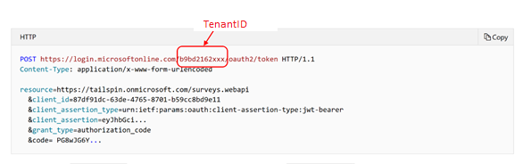

# Integrate Dynamics 365 Fraud Protection real-time APIs

To securely integrate your existing systems with the Microsoft Dynamics 365 Fraud Protection real-time application programming interfaces (APIs), you must complete the following tasks:

1. Create an app registration in the Microsoft Azure portal, and use it to get an access token to your Dynamics 365 Fraud Protection API endpoints.
1. Call the Dynamic 365 Fraud Protection real-time APIs.

## Create an Azure AD app registration in the Azure portal

Follow these steps to create an Azure Active Directory (Azure AD) app registration in the Azure portal.

1. Open the [Azure portal](https://portal.azure.com).
1. In the navigation pane, select **Azure Active Directory**.
1. In the left pane, under **Manage**, select **App registrations (Preview)**. The **App registrations (Preview)** page appears. You can return to this page at any time to view your app registrations.
1. Select **New registration**.
1. Enter any name (for example, **API service account**). In the **Supported account types** field group, leave the **Accounts in this organizational directory only (\<your tenant name\>)** option selected. The Web URI is optional. It can be any URL that starts with **https://**.

For more information about how to configure API access to your Dynamics 365 Fraud Protection endpoint via the Azure portal, see [How to: Use the portal to create an Azure AD application and service principal that can access resources](https://docs.microsoft.com/azure/active-directory/develop/howto-create-service-principal-portal).

Alternatively, if you prefer to use Microsoft Windows PowerShell to create an Azure AD app registration, see [New-AzureRmADApplication](https://docs.microsoft.com/powershell/module/azurerm.resources/new-azurermadapplication?view=azurermps-6.13.0).

## Grant your Azure AD app access to the Dynamics 365 Fraud Protection real-time APIs

To assign the appropriate Dynamics 365 API role to your Azure AD app, use the [New-AzureADServiceAppRoleAssignment Windows PowerShell script](https://docs.microsoft.com/powershell/module/azuread/new-azureadserviceapproleassignment?view=azureadps-2.0), as shown in the following example.

```console
$c_app_name = "your Azure AD application display name here"

# Pick a role to assign; use Risk_API for production or Sandbox_Risk_API for sandbox (test) access.
$c_app_role_name = "API role here"

################################################################
# -- there is no need to change the script below this line –- 
################################################################
$app_name = "Dynamics 365 Fraud Protection"
$sp = Get-AzureADServicePrincipal -Filter "displayName eq '$app_name'"

#Assign AppRole
$c_appRole = $sp.AppRoles | Where-Object { $_.DisplayName -eq $c_app_role_name }
$c_sp = Get-AzureADServicePrincipal -Filter "displayName eq '$c_app_name'"
New-AzureADServiceAppRoleAssignment -ObjectId $c_sp.ObjectId -PrincipalId $c_sp.ObjectId -ResourceId $sp.ObjectId -Id $c_appRole.Id 
```

## Call the Dynamics 365 Fraud Protection real-time APIs

To get real-time fraud protection, you can use an event-based call to integrate your transactional sales systems with Dynamics 365 Fraud Protection. Follow these steps.

<ol>
    <li>Get your IDs:
      <ul><li>Directory (tenant) ID – Get this ID from the Azure portal. It's the globally unique identifier (GUID) for a tenant's domain in Azure. It appears on the <b>Account Information</b> tile on the Dynamics 365 Fraud Protection dashboard. The following illustration shows the location.</li>
         
    <li>Sandbox resource URI or production resource URI – This first-party app ID appears on the <b>Account Information</b> tile on the Dynamics 365 Fraud Protection dashboard.<br/>i [Sandbox]: (https://api.dfp.microsoft-int.com)<br/>ii [Production]: (https://api.dfp.microsoft.com)</li>
    <li>Application (client) ID – For information about how to create this ID, see the <i>Create an Azure AD app registration in the Azure portal</i>(#create-an-azure-ad-app-registration-in-the-azure-portal) section of this topic. In the Azure portal, this ID is known as the application (client) ID. To find this application ID in Azure AD, select <b>App registrations (Preview)</b>.</li>
    <li>InstanceID – This ID is the ID that you use for [device fingerprinting](https://go.microsoft.com/fwlink/?linkid=2085697). It identifies the instance of Dynamics 365 Fraud Protection where you will enter data. It appears on the <b>Account Information</b> tile on the Dynamics 365 Fraud Protection dashboard.
          </li>
        </ul>
    </li>
    <li>
       Generate an access token. For more information, see <a href="https://docs.microsoft.com/azure/architecture/multitenant-identity/client-assertion">Use client assertion to get access tokens from Azure AD</a>.
     <div class="alert">
         <p class="alert-title"><span class="docon docon-status-error-outline"></span> <b>Note</b></p>
         <p>You must generate this token and provide it dynamically. For more information, see (<a href="https://docs.microsoft.com/azure/active-directory/develop/active-directory-configurable-token-lifetimes#configurable-token-lifetime-properties">Configure token lifetimes</a>.
</p>
        </div><br/>
    </li>
    <li>
        When you call Dynamics 365 Fraud Protection APIs, you must pass the following required HTTP headers on each request.
    <table>
    <tr>
    <th>Header name</th>
    <th>Header value</th>
    </tr>
    <tr>
    <td>Authorization</td>
    <td>
        To get an access token, use the Azure AD app. <br /><br />
        <b>Note</b> The access token has a limited lifespan. We recommend that you cache it and reuse it until it's time to get a new access token.<br /><br />
    Use the following format for this header (replace <i>accesstoken</i> with the actual token value):<br />
        <ul><li> Bearer <i>accesstoken</i>, where accesstoken is the token that is returned by Azure AD.</li></ul>
    </td>
    </tr>
    <tr>
    <td>x-ms-correlation-id</td>
    <td>Send a new GUID value on each set of API calls that are made together.</td>
    </tr>
    </table>
    </li>
   <li>Generate an event-based payload. Fill in the event data with the relevant information from your transactional system. For documentation about all supported events, see <a href="https://apidocs.microsoft.com/fwlink/?linkid=2084942">Dynamics 365 Fraud Protection API</a>.
    </li>
   <li>Combine the header (which includes the access token) and the payload, and send them to your Dynamics 365 Fraud Protection endpoint.</li>
   <li>In the Evaluate experience for Dynamics 365 Fraud Protection, you can send transactions over and analyze the results from Dynamics 365 Fraud Protection.</li>
   <li>In the Protect experience for Dynamics 365 Fraud Protection, you can send transactions over and honor decisions that are based on your configured rules.</li>
    </ol>

For more information about access tokens, see [How to: Use the portal to create an Azure AD application and service principal that can access resources](https://docs.microsoft.com/azure/active-directory/develop/howto-create-service-principal-portal).

## Assign Dynamics 365 access role to your Azure AD app

To enable your apps to access Dynamics 365 Fraud Protection APIs in your tenant, you must set up service-to-service API access and service-to-service roles. Both the sandbox (test) and production (live) versions are available.

To access Dynamics 365 Fraud Protection sandbox APIs, in the Dynamics 365 Fraud Protection sandbox environment, assign the **Sandbox Risk\_API** role to the Azure AD app that you created earlier (see the [Create an Azure AD App registration in the Azure portal](#create-an-azure-ad-app-registration-in-the-azure-portal) section of this topic).

| App role | Description | Rights |
|---|---|---|
| Sandbox\_Risk\_API | This role grants access rights to all areas and functionality of the Dynamics 365 Fraud Protection portal, including all APIs that the portal calls. | API access |

To access Dynamics 365 Fraud Protection production APIs, in the Dynamics 365 Fraud Protection production environment, assign the **Risk\_API** role to the Azure AD app that you created earlier.

| App role | Description | Rights |
|---|---|---|
| Risk\_API | This role grants access rights to all areas and functionality of the Dynamics 365 Fraud Protection portal, including all APIs that the portal calls. | API access |
