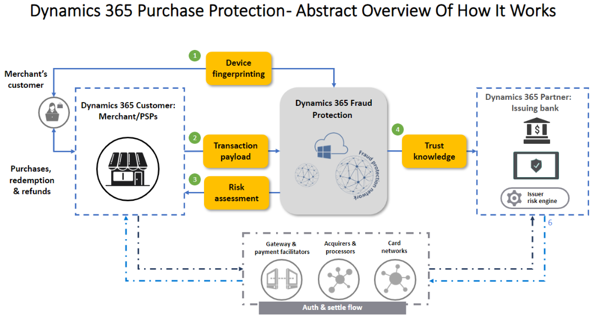

This article provides visual abstract representation and description of how Microsoft Dynamics 365 Fraud Protection – Purchase Protection interacts with various entities such as customers and banks. The diagram below highlights at an elevated level some of the product capabilities and APIs (Application Programming Interfaces) to help you better understand these interactions.  

**The areas in the above diagram include:** 

- **1.Device Fingerprinting:** Device fingerprinting lets you collect crucial device telemetry during online actions. This information includes hardware information, browser information, geographic information, and the Internet Protocol (IP) address. This feature is based on artificial intelligence (AI) and can be used as input to the process of fraud assessments. It can be deployed for both browser based and mobile based applications. There is a Java-based web SDK (software development kits) and iOS, Android and React Native SDKs for mobile applications are available.

- **2.Transaction Payload:** Information our customers pass along to Dynamics Fraud Protection related to the transaction. This data is then compared to data already within our fraud protection network where our machine learning will look for linkages. 

- **3.Risk Assessment:** The machine learning model can then return a risk score. The scoring can tell you the probability of fraud risk, or the likelihood of possible fraud that you may want to review or reject. 

- **4.Trust Knowledge (Transaction Acceptance Booster):** This feature helps you benefit from higher acceptance rates by sharing trust knowledge with banks.

At high level this is how Dynamics 365 Fraud Protection works for Purchase Protection. 

On the left-hand side. You can see these are the Dynamics 365 Fraud Protection customers and their customers. The customer is in control of their UX (User experience) and systems and can decide to implement Dynamics Fraud Protection device fingerprinting **(number 1 and 2)** in their UI (user interfaces) for both browser based and mobile based applications.  A Java-based web SDK (software development kits) and iOS, Android and React Native SDKs for mobile applications are available. 

When a purchase takes place, an API from Dynamics 365 Fraud Protection side is called with specific information, to then pass along to Dynamics 365 Fraud Protection **(number 2)**. Then that data is compared to the data already within our fraud protection network. Dynamics Fraud Protection machine learning will then try to find linkages and see past behavior coming from data attributes such as IP address, geo location, and many other device fingerprinting attributes, as well as other data attributes related to the activity of the entities within the transaction such as velocities or the timing of transactions.  

Then on top of the machine learning analysis, there are some simple predefined rules that  Dynamics 365 Fraud Protection customers can set up or you can set up your own custom rules, which would give a response back to you saying the purchase should either be approved or rejected, with this kind of fraud risk or bot score, and along with the reason for the decision that was made.    

As you can see in **(number 3)**, Risk Assessment. These device attributes go into the Dynamics 365 Fraud Protection machine learning model with which we then return a score to you for bot and risk scores. The scoring is important because it tells you the probability the transaction is fraudulent, or the likelihood of fraud that you may want to review or reject. The lower the score, the less likelihood of fraud and the higher the score, the greater probability of fraud.  

On the right-hand side in **(number 4)** you can see we are also partnering with a set of issuing banks via a feature we call Transaction Acceptance Booster. This feature helps you achieve higher bank acceptance rates by sharing some of the intelligence Dynamics 365 Fraud Protection has about the transaction, known as Trust Knowledge, with the issuing banks.  This is data that the issuing bank would not see without Dynamics 365 Fraud Protection and allows them to have higher confidence in their assessment of the transaction and therefore accept many transactions that they would otherwise have rejected.  

 
**API Abstract Diagram -** Below is an abstract diagram of how Microsoft Dynamics 365 Fraud Protection Purchase Protection connects with our customer’s front and back end and provides API descriptions. For Dynamics Fraud Protection to do its best job of adapting to fraud patterns, it is vital for DFP to understand the lifecycle of the transaction and so DFP offers a set of APIs that let the merchant describe that to us.  
 

 
**The areas in the above diagram include:** 
 
- **Device Fingerprinting (front end):** Device fingerprinting lets you collect crucial device telemetry during online actions. This information includes hardware information, browser information, geographic information, and the Internet Protocol (IP) address. This feature is based on artificial intelligence (AI) and can be used as input to the process of fraud assessments. It can be implemented for both browser and mobile based. A Java-based web SDK (software development kits) and iOS, Android and React Native SDKs for mobile applications are available.
 
- **Purchase Assessment API (back end):** The Purchase API collects data attributes that include transaction context. This data is then compared to data already within our fraud protection network where our machine learning will look for linkages and similarities to known emerging fraud patterns. 

- **Bank Event (back end):** Bank Event API is used to inform DFP of the bank’s authorization decision.  For example, approving or rejecting the transaction.  It can also be used to inform DFP about related events such as a CVV or 3DS challenge. 

- **Purchase Status (back end):** Purchase status is used to inform Dynamics Fraud Protection of the merchant's final decision on the transaction. Knowing whether the transaction happened or was rejected for any reason (e.g., insufficient inventory, a trade block, etc.) it is important to let DFP adapt and learn from the merchant’s fraud patterns. 

- **Label API (back end):** Enables you to send additional information to Microsoft Dynamics 365 Fraud Protection in addition to the data that informs the virtual fraud analyst and scorecard features. The labels API provides additional knowledge for model training based on an additional set of fraud signals.

**Device Fingerprinting (#1, front end)** On the left-hand side we have Device Fingerprinting both for browser based as well as mobile based, and this is embedded on the front-end side. Device fingerprinting lets you collect crucial device telemetry during online actions. This information includes hardware information, browser information, geographic information, and the Internet Protocol (IP) address. Microsoft Dynamics 365 Fraud Protection provides a device fingerprinting feature that is based on artificial intelligence (AI). Therefore, device identification can be used as input to the process of fraud assessment. Additionally, this feature helps the Fraud Protection service track and link unrelated events in the fraud network, to help identify patterns of fraud. The data collected is not just a static list of attributes but also includes data dynamically captured based on the evaluation of specific combinations of attributes, such as browser, system, network, and geo-location attributes. When device characteristics and attributes are collected, the device fingerprinting service uses machine learning to probabilistically identify the device. Device fingerprinting runs on Azure, and includes benefits from proven cloud scalability, reliability, and enterprise-grade security.   

 

**Purchase API (#2, back end):** The APIs highlighted in green (numbers 2, 3, 4, 5) are the back-end integrations, and this is where your customer is not present.  Next to the first green box you can see (#2) Purchase API. The Purchase API mainly collects data attributes that include transaction context (such as order type and order-initiated channel), transaction time (such as customer local time), user information (such as account ID, email address, country or region, and creation date), payment instrument information (such as payment instrument ID, payment method, Bank Identification Number [BIN (Bank Identification Numbers)], and billing address), product information (such as product type, stock keeping unit [SKU], name, price, and quantity), device information (such as IP address and device context ID), and some additional information. This information helps determine which of your policies or rules will be executed and returned to you in the risk score and is important to the ML (machine learning) models which affect the quality of the score. The Purchase Status API, Bank Event API, and Label APIs collect corresponding feedback information to update the final status of a transaction. 

**Bank Event API (#3, back end):** After the purchase takes place there is a bank event coming in. In this example, this Bank Event API is related to the bank authorization results as approving the transaction or rejecting the transaction. If you also have other details such as CVV (Card Verification Value) challenge result, an AAVS (Address Validation Services) or 3DS, Dynamics 365 Fraud Protection will also welcome that information. 

**Purchase Status API (#4, back end):** Dynamics Fraud Protection wants to know what the final status decision our customers made on the transaction. For example, did you approve or reject the transaction? The purchase status that you send back to Dynamics Fraud Protection will help ensure the right information is being considered in our machine learning going forward and helps with the robust reporting that we provide you. 

**Label API (#5, back end):** The Label API enables you to send additional information to Microsoft Dynamics 365 Fraud Protection. The labels API provides additional knowledge for model training based on an additional set of fraud signals. Labels are charged by manual review and any other way you can confirm fraud. If you have additional data such as chargeback or other data points or refunds, we welcome that too. You can use the Fraud Protection labels API to send information about transactions, account or payment instrument details, and reversals. 

 
