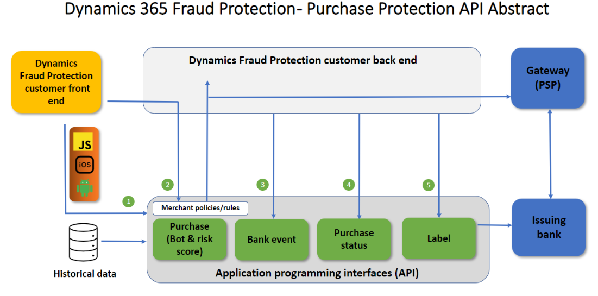

# How purchase protection works 

This article describes how Microsoft Dynamics 365 Fraud Protection purchase protection interacts with various entities such as customers and banks.

The following illustration highlights some of Fraud Protection's purchase protection capabilities and application programming interfaces (APIs) to help you better understand risk assessment interactions.

- **Device fingerprinting (1)** - Device fingerprinting enables you to collect crucial device telemetry during online actions. This information includes hardware information, browser information, geographic information, and the Internet Protocol (IP) address. This feature is based on artificial intelligence (AI) and can be used as input to the fraud assessments process. Device fingerprinting can be deployed for both browser-based and mobile-based applications. A Java-based web software development kit (SDK) is available, as are iOS, Android, and React Native SDKs for mobile applications.
- **Transaction payload (2)** - The transaction payload contains information related to a transaction that clients pass along to Fraud Protection. This data is compared to data already within the Fraud Protection network, where the machine learning model analyzes the data for linkages. 
- **Risk assessment (3)** - Fraud Protection's machine learning model can return a score to you for bot and risk scores. The scoring advises you of the probability of fraud risk, or of the likelihood of possible fraud that you may want to review or reject. 
- **Trust knowledge (transaction acceptance booster) (4)** - This feature helps you benefit from higher acceptance rates by sharing trust knowledge with banks.

## Required APIs and components

The following APIs and components are required to take advantage of Fraud Protection account protection's features.

- **Device fingerprinting (front end)** <!-- Device fingerprinting lets you collect crucial device telemetry during online actions. This information includes hardware information, browser information, geographic information, and the Internet Protocol (IP) address. This feature is based on artificial intelligence (AI) and can be used as input to the process of fraud assessments. It can be implemented for both browser and mobile based. A Java-based web SDK (software development kits) and iOS, Android and React Native SDKs for mobile applications are available.-->
- **Purchase API (back end)** - This API collects data attributes that include transaction context. This data is compared to data already within the fraud protection network, where machine learning will search for linkages and similarities to known emerging fraud patterns.
- **Bank event API (back end)** - This API is used to inform Fraud Protection of the bank’s authorization decision (for example, approving or rejecting the transaction). It can also be used to inform Fraud Protection about related events such as card verification value (CVV) or 3D Secure (3DS) challenges. 
- **Purchase status API (back end)** - This API is used to inform Fraud Protection of the client's final decision on the transaction. Informing Fraud Protection whether a transaction was approved or rejected for any reason is important to let Fraud Protection adapt and learn from the client's fraud patterns. 
- **Label API (back end)** - This API enables you to send additional information to Fraud Protection about transactions, account or payment instrument details, chargebacks, refunds, and reversals. The labels API provides knowledge for model training based on a set of fraud signals.

## How Fraud Protection purchase protection connects with clients

The following illustration shows how Fraud Protection purchase protection typically connects with clients. For example, at which stage of the process does an API call take place, which API is called, and which Dynamics 365 components return information to clients.

The numbered elements in the illustration are further explained below.

**Device fingerprinting (1, front end)** - Browser-based and mobile-based device fingerprinting is embedded on the front-end side. This feature works with Fraud Protection to track and link unrelated events in the fraud network to help identify patterns of fraud. The data collected is not just a static list of attributes but also includes dynamically captured data based on the evaluation of specific combinations of attributes such as browser, system, network, and geolocation attributes. When device characteristics and attributes are collected, the device fingerprinting service uses machine learning to identify the device. Device fingerprinting runs on Azure, and includes benefits from proven cloud scalability, reliability, and enterprise-grade security.   

**Purchase API (2, back end)** - The purchase API mainly collects data attributes that include transaction context (such as order type and order-initiated channel), transaction time (such as customer local time), user information (such as account ID, email address, country or region, and creation date), payment instrument information (such as payment instrument ID, payment method, Bank Identification Number (BIN), and billing address), product information (such as product type, stock keeping unit (SKU), name, price, and quantity), device information (such as IP address and device context ID), and some additional information. This information helps determine which of your policies or rules will be executed and returned to you in the risk score and is important to the machine learning models that affect the quality of the score.

**Bank event API (3, back end)** - The bank event API is a back-end integration, and collects corresponding feedback information to update Fraud Protection with the final status of a transaction. 

**Purchase status API (4, back end)** - The purchase status API is a back-end integration, and collects corresponding feedback information to update Fraud Protection with the final status of a transaction. 

**Label API (5, back end)** - The label API is a back-end integration, and collects corresponding feedback information to update Fraud Protection with the final status of a transaction.

# Additional resources

[Purchase protection overview](purchase-protection.md)

[Set up your purchase protection service](promocode-set-up-purchase-protection.md)
