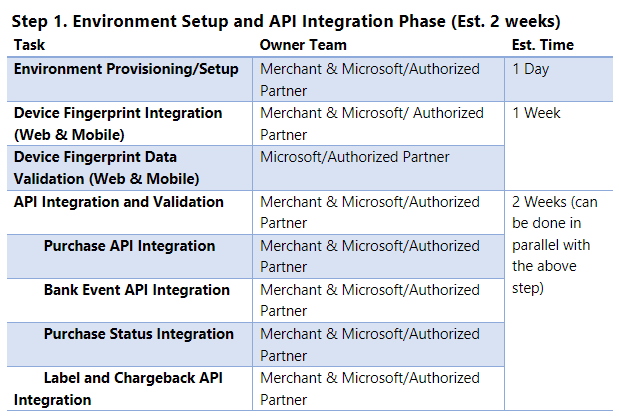

# Onboarding planning for account purchase protection

This article describes onboarding planning for Microsoft Dynamics 365 Fraud Protection purchase protection. Onboard planning will help you understand and plan for the project onboarding milestones of Fraud Protection purchase protection integration and onboarding. For more information on the integration steps, see [Set up purchase protection](promocode-set-up-purchase-protection.md).

## Onboarding milestones

The tables in this section provide details about the onboarding milestones for the environment setup and application programming interface (API) integration, protection, advanced modeling, and the advanced protection and fraud ops phases.

> [!NOTE]
> - All timeframes below are estimates. Actual time taken can vary based on Merchant, and Microsoft/Authorized Partner availability and focus. 
> - Microsoft performs the data validation, but clients must enable API calls and start sending a small percentage of production traffic first. Post validation, clients can send all traffic which will help the project move to the next step. 

<!---->

<!---->

### Environment setup and API integration phase

The following table lists the environment setup tasks, owner teams, and estimated times for implementation of the environment setup and API integration phase.

| Task | Owner team | Estimated time |
|------|------------| ---------------|
| Environment provisioning and setup | Client and Microsoft/authorized partner | One (1) day |
| Device fingerprinting integration (web and/or mobile) | Client and Microsoft/authorized partner | One (1) week |
| Device fingerprinting data validation (web and/or mobile) | Microsoft/authorized partner | One (1) week |
| Purchase API integration and validation | Client and Microsoft/authorized partner | Two (2) weeks (This task can be done in parallel with the preceding tasks.) |
| Bank event APT integration and validation | Client and Microsoft/authorized partner | Two (2) weeks (This task can be done in parallel with the preceding tasks.) |
| Purchase status API integration and validation | Client and Microsoft/authorized partner | Two (2) weeks (This task can be done in parallel with the preceding tasks.) |
| Label and chargeback API integration and validation | Client and Microsoft/authorized partner | Two (2) weeks (This task can be done in parallel with the preceding tasks.) |

### Protection phase
<!--Step 3-->

The following table lists the environment setup tasks, owner teams, and estimated times for implementation of the protection phase.

| Task | Owner team | Estimated time |
|------|------------| ---------------|
| Historical data upload (optional) | Client | One (1) day |
| Partner training (rules engine, velocity SRO, etc.)  | Client and Microsoft/authorized partner | One (1) day |
| Transaction acceptance booster (TAB) opt-in | Microsoft/authorized partner | One (1) day |
| Rule creation and migration | Client | Two (2) days |

### Data accumulation phase

No actions for the client and Microsoft/Authorized partner during this phase. Accumulation starts right after data quality is signed off during the API integration phase. Continue forward once the criteria below have been achieved:                                                                                                               
- At least 500 fraudulent transactions                                                                      
- At least 5000 non-fraudulent transactions                                                                    
- At least 4 weeks data with more than 70% label maturity rate \

### Advanced modeling phase

<!--[step 4](media/step4-PP-onboardingguide.png)-->

The following table lists the environment setup tasks, owner teams, and estimated times for implementation of the advanced modeling phase.

| Task | Owner team | Estimated time |
|------|------------| ---------------|
| Model training | Client | Two (2) weeks |
| Model shadow on production  | Client and Microsoft/authorized partner | One (1) week |
| Model switch | Microsoft/authorized partner | Upon notification |

#### Advanced protection and fraud ops tuning

The following table lists the task, owner team, and estimated time for advanced protecton and fraud ops analysis and adjustments.

| Task | Owner team | Estimated time |
|------|------------| ---------------|
| Score analysis and rule adjustment to optimize key performance indicators (KPIs) | Client | Ongoing |

## Resources 

Teh following resources provide more information for the above-referenced integration steps.

- [Fraud Protection overview](/dynamics365/fraud-protection/)
- [Create and provision your Azure tenant](promocode-set-up-dfp-purchased-version.md)
- [Set up a trial instance of Fraud Protection](promocode-set-up-dfp-trial-version.md)
- [Set up a purchased instance of Fraud Protection](promocode-set-up-dfp-purchased-version.md)
- [Configure user access](configure-user-access.md)
- [Set up purchased protection](promocode-set-up-purchase-protection.md)
- [Set up device fingerprinting](device-fingerprinting.md)
- [Integrate purchase protection APIs](integrate-real-time-api.md)
- [Integrate purchase APIs schema](https://dfpswagger.azurewebsites.net/index.html)
- [Integration training modules](/training/paths/deploy-work-account-purchase-protection/)

 
