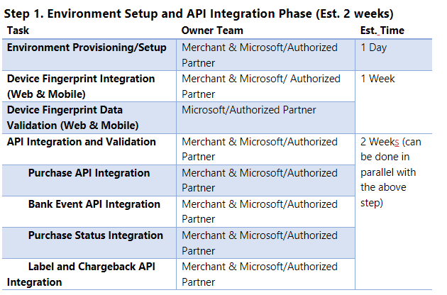
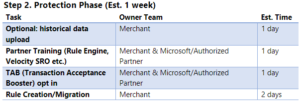
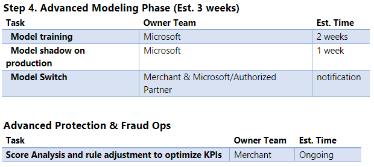

author: cschlegel2
description: This article explains Dynamics Fraud Protection 
ms.author: cschlege2
ms.date: 10/12/2022
ms.topic: reference
search.app: 
  - Capaedac-fraudprotection
search.audienceType:
  - Admin
  - IT Pro
title: Onboarding Planning Guide for Purchase Protection
ms.custom:

**Integration Planning Guide** This guide helps you understand and plan for the project milestones of Dynamics 365 Fraud Protection Purchase Protection integration and onboarding. To understand the integration steps below in more detail, please review the integration guide:  Set up purchase protection - Dynamics 365 Fraud Protection | Microsoft Learn 

**Onboarding Milestones - Integration Breakdown and Approximate Time** 

**Note:** All timeframes below are estimates. Actual time taken can vary based on Merchant, and Microsoft/Authorized Partner availability and focus. 

 

**Note:** Microsoft would perform data validation, but merchant needs to enable the API calls and start sending a small percentage of production traffic first. Post validation, merchants can send all traffic which will help the project move to the next step. 

**Step 3. Data Accumulation Phase (Est. 4 weeks)** 

No actions for Merchant and Microsoft/Authorized Partner during this phase. Accumulation starts right after data quality is signed off during API integration phase. Continue forward once the criteria below have been achieved:                                                                                                               

- At least 500 fraudulent transactions                                                                      

- At least 5000 non-fraudulent transactions                                                                    

- At least 4 weeks data with more than 70% label maturity rate 

**Resources** 

Below are additional resources to help provide more details of the above-referenced integration steps. 

​ 

Dynamics 365 Fraud Protection documentation - Dynamics 365 Fraud Protection | Microsoft Docs​ 

 

Create and provision your Azure tenant - Dynamics 365 Fraud Protection | Microsoft Docs​ 

 

Set up a trial instance - Dynamics 365 Fraud Protection | Microsoft Docs​ 

 

Set up a purchased instance - Dynamics 365 Fraud Protection | Microsoft Docs​ 

 

Configure user access - Dynamics 365 Fraud Protection | Microsoft Docs​ 

 

Set up purchase protection - Dynamics 365 Fraud Protection | Microsoft Docs​ 

 

Set up device fingerprinting - Dynamics 365 Fraud Protection | Microsoft Learn 

 

Integrate purchase protection APIs - Dynamics 365 Fraud Protection | Microsoft Docs​ 

 

Integrate purchase APIs documented at:  https://aka.ms/dfpswagger​ 

 

​Integration Training Modules - Deploy and work with Account Protection and Purchase Protection for Dynamics 365 Fraud Protection - Training | Microsoft Learn 

 

 
