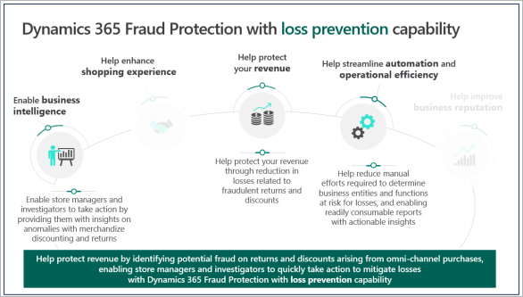
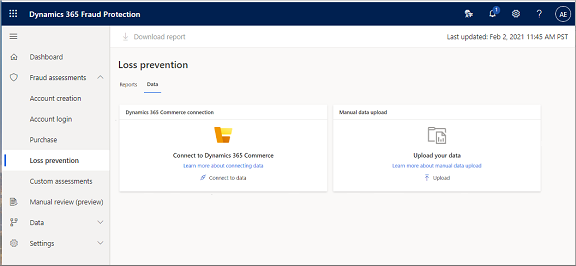
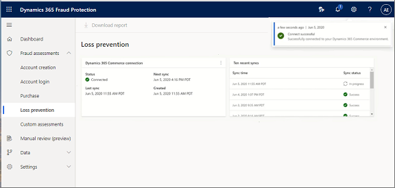
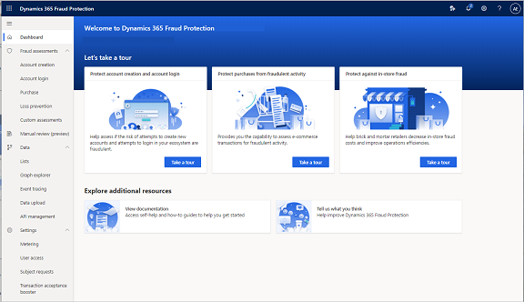
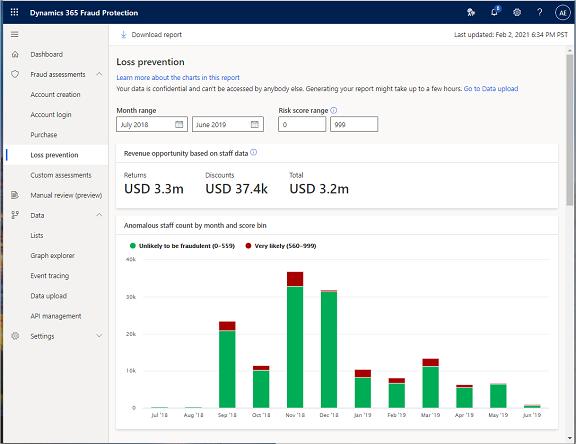
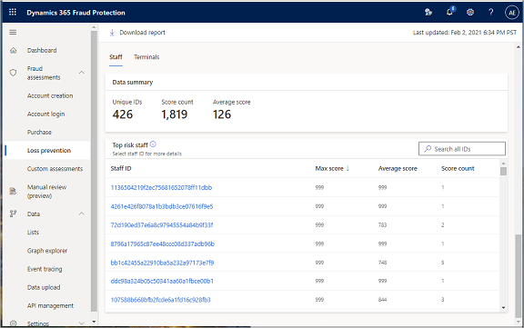

# Manage loss prevention with Fraud Protection

## Overview

The loss prevention capability in Microsoft Dynamics 365 Fraud Protection (Fraud Protection) uses adaptive artificial intelligence (AI) to generate risk scores, and to identify data anomalies and patterns in historical transaction data. You can then use these risk scores, anomalies, and patterns to generate reports that provide a detailed trend analysis, based on the return rate, the discount rate, and other key performance indicators (KPIs) that might indicate in-store fraud.

## Identifying fraudulent activity

The loss prevention capability is designed to help loss prevention analysts, store managers, and loss prevention investigators identify fraudulent activity that typically involves discounts, returns, price overrides, voided transactions, gift card redemption, and so on, that employees improperly apply on point of sale (POS) terminals.

Loss prevention is based on anomaly detection that looks for patterns in POS data that is ingested into the system. It identifies outliers through unsupervised machine learning (ML), and provides a list of anomalous terminals, anomalous actors, and anomalous products. Store managers, loss prevention analysts, and loss prevention fraud investigators can then use this list to focus on specific areas that might represent fraud.

Loss prevention can help you drive down the cost and complexity that are associated with the process of taking huge amounts of data, analyzing it for fraud patterns, and gaining actionable insights from it. Therefore, you can quickly identify your areas of risk, such as the store, terminal, shift, and/or which employee that might be misusing your return and discount policies.

## Goals for this document

The purpose of this document is to guide you through the following activities:

- [Step 1: Prepare your historical data](promocode-set-up-loss-prevention#step-1-prepare-your-historical-data-data-mapping). This activity is also known as *data mapping*.
- [Step 2: Upload data and generate a loss prevention report](hpromocode-set-up-loss-prevention#step-2-upload-data-and-generate-a-loss-prevention-report).
- [Step 3: Analyze data in a loss prevention report](promocode-set-up-loss-prevention#step-3-analyze-data-in-a-loss-prevention-report).

After you complete these steps in your own system by using your own data, you will have: an actionable loss prevention report. You will also be able to run loss prevention reports on a regular basis.

## Prerequisites

Before you begin the tasks in this document, you must:

-	Set up Fraud Protection in an AAD tenant, as described in [Set up a trial version of Fraud Protection.]()

## Step 1: Prepare your historical data (data mapping)

When Fraud Protection assesses a transaction for potential purchase fraud, it uses a combination of AI, ML, and a data consortium. A vast amount of data powers the models that are used for assessment. Any data that is transmitted into the system for assessment or system learning must conform to a predefined schema. In the world of AI and ML, it's generally understood that the quality of the data that a model uses affects the quality of the results.

*Data mapping* is a process that helps ensure that the correct values are assigned to the correct schema fields, and that your commerce system is correctly integrated with Fraud Protection. For more information about schemas, see [Data schemas for loss prevention](https://docs.microsoft.com/dynamics365/fraud-protection/view-loss-prevent-schemas). 

### Schema guidance for CSV files

Use this schema guidance to produce files in comma-separated values (CSV) format:

-	The files are in CSV UTF-8 (comma-delimited) format (*.csv).
-	The maximum file size is 10 gigabytes (GB).
-	The **DateTime** columns are in International Organization for Standardization (ISO) 8601 format. For example, **DateTime.UtcNow.ToString("o")** might have the result **"2019-03-14T20:18:11.254Z"**.
-	The decimal precision is two decimal places.
-	The following characters are escaped in all columns: commas, new line characters, and multiline characters.

For more information about schemas you can use to generate models and determine risk assessments, see [Data schemas for loss prevention](https://docs.microsoft.com/dynamics365/fraud-protection/view-loss-prevent-schemas). 

### Required data entities for data mapping

Because the loss prevention capability identifies anomalies and patterns that might indicate in-store fraud, the ML model requires data from four entities to search for anomalies:

-	Transactions
-	Sales
-	Payments
-	PaymentMethods

For detailed information about schemas that define the data that is used to generate models and determine risk assessments, see [Data schemas for loss prevention](https://docs.microsoft.com/dynamics365/fraud-protection/view-loss-prevent-schemas). Although all data fields are important, you can start with fewer mandatory fields and then onboard additional fields over time to improve model output.

> [!IMPORTANT]
>The data that is used to analyze loss is sensitive, and you should take care to upload it only from a secure network location. Be aware that Microsoft requests only partial data about payment instruments (the bank identification number [BIN] and the last four digits). We don't request the full payment instrument number or Social Security number (SSN). Therefore, don't include this type of data in the files that you upload. For more information about how data is used and protected in Fraud Protection, see [Security, compliance, and data subject requests](https://docs.microsoft.com/dynamics365/fraud-protection/security-compliance).

### What to do if you can't map all your data

Fraud Protection uses a broad set of data entities, and sometimes data might be missing, or it can't be mapped cleanly to a field. Microsoft has found that the following factors can cause data quality issues:

-	Attributes are unavailable.
-	Attributes are available, but they either aren't set or are incorrectly set.
-	The schema is incorrectly interpreted.
-	Data is incorrect, and/or enumeration values are incorrect.
-	There is a mismatch on the same attributes.
-	There is a data encryption issue.

Microsoft encourages you to try to map as many data fields as possible. However, keep the following points in mind if some fields can't be mapped:

-	You can always do the data uploads again at a later stage to improve the information that the system has access to.
-	To successfully do analysis and generate a report, you must have at least **one month's worth of transaction data**.

### Connect, disconnect, and reconnect to Fraud Protection

There are two ways to upload historical data into Fraud Protection for loss prevention:

-	Use the D365 Connector to connect to the Dynamics 365 Commerce system and upload the data directly.
-	Upload data files in CSV format.

Use the data connection method that is appropriate for your situation.

To connect loss prevention to Commerce, you must complete a series of one-time setup activities. After these activities are completed, you can easily disconnect and reconnect the systems.

Before you connect your retail data to Fraud Protection, make sure that you have all three of the following prerequisites:

-	Access to the retail data lake.
-	Access to your Finance and Operations environment.
-	A Fraud Protection license (trial or activated subscription).

#### Connect loss prevention to data from Commerce

1.	In Commerce, open the dashboard and enter **System Parameters** in the search field at the top of the page.
2.	On the **System parameters** page, select the **Data connection** tab.
3.	Set the **Enable Data Lake integration** option to **Yes**.
4.	Save the details of the data lake (the value of the **DNS name** field). You will need this information to reconnect if the data lake integration is ever disconnected.

5.	Return to the dashboard and enter **Entity Store** in the search field at the top of the page.

    (An entity store is a collection of tables/view that have retail data in raw or aggregate form.)
 	
6.	In the entity store, enter **RetailSales** in the search field.
7.	Under **Refresh options**, set the **Automatic refresh enabled** option to **Yes**.

    Automatic refresh incrementally adds the most recent data from POS devices to the retail data lake.

8.	Return to the dashboard and select the **Feature management** tile.
9.	In the **Feature management** workspace, find the **Dynamics 365 Fraud Protection (DFP) Loss Prevention** feature, and enable it.
10.	Register the Fraud Protection app ID in the dashboard:

    a.	Open the **Azure Active Directory applications** page.
    
    b.	Create an entry for the first-party app ID for Fraud Protection (**bf04bdab-e06f44f3-9821-d3af64fc93a9**).
    
    c.	In the **User ID** field, select **RetailServiceAccount**.

    This setting authorizes Fraud Protection to access data from the data lake.

11.	Open the [Fraud Protection portal](https://dfp.microsoft.com/) and connect your **Finance and Operations** environment to your **Fraud Protection** environment by using the URL for your Commerce environment.
	
    In the following screenshot, the connection was successful, and the process of syncing to acquire data from Commerce and generate a loss prevention report has started.

### Disconnect from and reconnect to Commerce

After you've made the initial connection between Commerce and Fraud Protection, you can easily disconnect and reconnect.

#### Disconnect from Commerce

1.	Select the three dots in the upper-right corner of the **Dynamics 365 Commerce connection** pane, and then select **Disconnect**.
2.	Select **Continue** to disconnect.

 	The data lake that was originally connected to this Fraud Protection loss prevention capability is disconnected.

#### Reconnect to Commerce

1.	Select **Connect to data**.
2.	Enter the details that were created for the Commerce environment (data lake) during the initial setup. (See step 4 in the [Connect loss prevention to data from Commerce](promocode-set-up-loss-prevention.md#connect-loss-prevention-to-data-from-commerce) section earlier in this document.)
3.	Select **Connect**.

When the connection is successful, the process of syncing to acquire the data and update the reports immediately starts again.

## Step 2: Upload data and generate a loss prevention report

When you sign in to your Fraud Protection portal, if **Loss prevention** appears in the left navigation pane, the loss prevention capability is enabled.

1.	Select **Loss prevention**, and then select the **Data** tab.
2.	Select **Upload** for a manual data upload.

    This version of loss prevention is specifically focused on analyzing returns and discounts. It requires four types of data sets from sales terminals:

    -	Transactions
    -	Sales
    -	Payments
    -	Payment methods

    > [!NOTE]
    >The data must be in .CVS format and must follow the schema that is provided in [Data schemas for loss prevention](https://docs.microsoft.com/dynamics365/fraud-protection/view-loss-prevent-schemas).

3.	Select the data file to upload, and then select **Upload**.

    After you've uploaded the data, the **Generate reports** button becomes available.

4.	Select **Generate reports**.

    Fraud Protection starts to generate the report and shows it on the **Reports** tab of the **Loss prevention** page.

    > [!NOTE]
    >Typically, loss prevention takes about 30 to 60 minutes to generate a report package. However, the actual length of time depends on the amount of data that was provided.

## Step 3: Analyze data in a loss prevention report

In the previous step, you configured and ran your first loss prevention report. You can now use the findings on the report to identify return and discount anomalies, and then run additional loss prevention reports as new data becomes available.

When Fraud Protection has a data source, you can generate loss prevention reports. Depending on how you configured your environment, you should have reports that have been generated from either a direct connection to a Commerce system or uploaded from CSV files.

#### The Loss prevention page

1.	On the **Data** tab of the **Loss prevention** page, review the following information:

    -	The **Dynamics 365 Commerce connection** pane provides a quick overview of the connection. It includes information about when the next refresh is expected, when the last refresh was completed, the status of the connection, and any errors that have occurred.
    -	The **Ten recent syncs pane** shows a log of the ten most recent synchronizations and the status of each.

2.	To generate a set of interactive reports, based on the data that the models have ingested and analyzed, select the **Reports** tab.
3.	Review the following information:

    -	The **Revenue opportunity based on staff data** pane (labeled "3" in the following screenshot) provides a quick summary of the total dollar amount of the potential fraud that Fraud Protection has detected in returns and discounts, and that could contribute to overall revenue gain.
    -	The **Revenue opportunity based on terminal data** pane (labeled "4") provides a quick summary of the total amount of potential fraud that Fraud Protection has detected in returns and discounts, based on terminal data.
    -	The **Anomalous staff count by month and score bin** and Anomalous terminals count by month and score bin** charts (labeled "5") show anomalous staff and terminal count distribution per month during the month range that you selected in the **Month range** fields at the top of the page.
    -	In the **Risk score range** fields at the top of the page (labeled "6"), you can set the risk score range. To view the full range of risk score distribution, set the "from" value to 0 (zero) and the "to" value to **999**.

4.	To drill deeper into possible fraudulent activities, adjust the values of the **Risk score rang**e fields so that they span only a high score range, for example, **900** through **999**.

5.	Scroll down the report to the **Staff** tab. Here, the data set is sorted to show the staff, based on the risk score that the models have generated. Review the following information:

    -	The **Data summary** section (labeled "7" in the following screenshot) provides a summary of the staff assessment. It shows the total number of unique staff IDs, the number of times that the unique staffers were anomalous during the reporting data period, and the average risk score on a scale of 0 (zero) through 999.
    -	In the search field in the **Top risk staff** section (labeled "8"), you can enter a staff ID to search for data that is related to a specific staff member.
    -	The grid in the **Top risk staff** section (labeled "9") lists all staff IDs that the model has analyzed. The list is sorted in descending order of risk score (that is, the highest-risk staff member appears at the top of the list). The grid also shows the average score for each staff member and the number of times that each staff member was deemed anomalous during the full data period that was assessed for the report. For example, if 12 months' worth of data was used to generate the report, a **Score count** value of **3** for a staff member indicates that the staff member was deemed anomalous for three of the 12 months. By selecting a staff ID, you can drill down to get more details about a specific staff member. More information about the drill-down report is provided later in this document.

6.	To see similar information based on terminal data, select the **Terminals** tab.
7.	Review the following information:

    -	The **Data summary** section (labeled "10" in the following screenshot) provides a summary of the terminal assessment. It shows the total number of unique terminal IDs that the model has analyzed, the number of times that the unique terminals were anomalous during the reporting data period, and the average risk score on a scale of 0 (zero) through 999.
    -	In the search field in the **Top risk terminals** section (labeled "11"), you can enter a terminal ID to search for data that is related to a specific terminal.
    -	The grid in the **Top risk terminals** section (labeled "12") lists all terminal IDs. The highest-risk terminal appears at the top of the list. The grid also shows the average score for each terminal and the number of times that each terminal was deemed anomalous during the full data period that was assessed for the report.

8.	If you're interested in a specific terminal in the list, select the terminal ID to drill down into the details.
9.	Review the following information:

    -	In the **Month range** fields (labeled "13" in the following screenshot), you can set the range of months that you want to analyze the data for.
    -	In the **Risk score range** fields (labeled "14"), you can set the risk score range. To drill deeper into possible fraudulent activities, keep the score range high.
    -	The **Terminal's risk score summary** section (labeled "15") provides a quick summary. It shows the maximum score, the average score, and the number of times that this specific store or terminal has been anomalous.

If you want to better understand how a specific terminal has been working, a useful tool is trend analysis that compares the score of a specific terminal to the score of the whole population. The example chart in the following screenshot shows the variation in risk score by month.
    
When you hover over a specific data point in the chart, the terminal's risk score and the average risk score of the whole population are shown. In the following example, the sawtooth pattern is a good representation of the fact that this terminal has been moving back and forth in terms of anomalous behavior.

The model uses five or six default events to generate the risk score. It considers the return ratio, which is the total number of returns that employees have initiated at a specific terminal, divided by the total number of sales at that terminal during a given period. It also considers the cash-to-card ratio and the number of employee-discounted purchases where multiple payment cards were used. Finally, it considers the ratio of returns without a receipt to returns with a receipt, and the number of discounted items that were sold without a discount.

10.	To understand how each event or reason affected the risk scores, review the following information on the report:

    -	The grid in the **All reasons affecting the score by percentile** section (labeled "16" in the following screenshot) lists the specific reasons that affect the risk score, ranked by the percentile. Significant percentiles are highlighted.
    -	In the **Reason** field in the **Reason details** section (labeled "17"), you can select any of the five reasons from the **All reasons affecting the score by percentile** grid to further analyze the impact of that reason on the risk score.
    -	The chart in the **Reason details** section (labeled "18") shows the value by month for the reason or event that you selected in the **Reason** field.

11.	If you scroll down more, the **Transactions (last six months)** section of the report shows specific transactions that have occurred at the terminal during the last six months:

    -	As the column headings for the grid (labeled "19" in the following screenshot) show, the data in the grid includes the date of the transaction according to the receipt, the transaction ID, the staff ID, the purchase amount, the discount amount, the return amount, an indication of whether a return receipt was present, the payment method, and the category.
    -	As the example in the following screenshot shows, if the staff member who is associated with a transaction was tagged as anomalous by the model, a red caution sign appears next to their staff ID in the grid (labeled "20"). This caution sign identifies the staff member as a high risk.

    If you're an existing Commerce customer, all the mandatory fields have a **NOT NULL** constraint in the data type. For reference, the schema is included in the appendix at the end of this document. However, you can configure Commerce to share data directly with Fraud Protection.

For information about how to integrate Commerce with Fraud Connection and connect to Fraud Protection, see the [Connect loss prevention to data from Commerce](promocode-set-up-loss-prevention.md#connect-loss-prevention-to-data-from-commerce) section earlier in this document. There is no prerequisite schema work for loss prevention.

Congratulations! You've successfully completed the training and are ready to use your free trial of Fraud Protection's loss prevention capabilities.

## Next steps

For information about how to access and use Fraud Protection's features, see the following documents:

-	[Protect customer accounts with Fraud Protection]()
-	[Protect customer purchases with Fraud Protection]()

