# Set up purchase protection

Microsoft Dynamics 365 Fraud Protection includes purchase protection capabilities to help you assess commerce transactions for fraudulent activity. Purchase protection capabilities let you review historical data, use a customizable rules engine and risk support toolset, and fine-tune fraud protection decisions, based on the knowledge that you gain from using the Fraud Protection service and the Microsoft fraud protection network. You can then use these findings by implementing strategies that support your customers.

## Using transaction data

After you configure real-time API calls with Fraud Protection, transaction data automatically starts to flow into the system. This document shows how to use this historical data. It focuses on three areas:

## Goals for this document

This document guides you through the following activities:

- [Step 1: Upload historical data, generate Diagnose reports, and view sample reports.](promocode-set-up-purchase-protection.md#step-1-upload-historical-data-generate-diagnose-reports-and-view-sample-reports)
- [Step 2: Interpret diagnose data in diagnostic and risk reports](promocode-set-up-purchase-protection.md#step-2-interpret-diagnose-data-in-diagnostic-and-risk-reports).
- [Step 3: Integrate purchase protection APIs](promocode-set-up-purchase-protection.md#step-3-integrate-purchase-protection-apis).
- [Step 4: Understand purchase events](promocode-set-up-purchase-protection.md#step-4-understand-purchase-events).
- [Step 5: Use common support tool and graph explorer scenarios](promocode-set-up-purchase-protection.md#step-5-use-common-support-tool-and-graph-explorer-scenarios).

After you complete these activities, you will be able to use the Fraud Protection tools and reports with your own data to develop a better understanding of your own risk posture.

## Prerequisites

Before you begin the activities in this document, you must complete the following tasks:

-	Set up Fraud Protection in an Azure Active Directory (Azure AD) tenant, as described in [Set up a trial version of Fraud Protection](promocode-set-up-dfp-trial-version.md).
-	[Set up device fingerprinting](device-fingerprinting.md).

## Step 1: Upload historical data, generate Diagnose reports, and view sample reports

The use of historical purchase transaction data is separated into two experiences:

-	**Historical data upload**, which increases the accuracy of your purchase protection when Fraud Protection is configured for real-time transaction assessment. These uploads include data for purchases, chargebacks, merchant and bank decisions, and accounts. Historical data helps accelerate the process of priming the machine learning (ML) model. It can also help improve the handling of your future transactions. You can view uploaded data by using the support tool or the graph explorer.
-	**The Diagnose report**, which helps you evaluate uploaded historical data and generate reports that provide actionable risk insights into existing fraud patterns in your business.

In both cases, you will create and upload comma-separated values (CSV) data files. To help ensure that Fraud Protection can correctly interpret the files that you upload, make sure that your data files meet the following requirements, and that they follow the required schemas:

-	The files are in CSV UTF-8 (comma delimited) format (*.CSV).
-	The maximum file size is 10 gigabytes (GB).
-	The **DateTime** columns are in International Organization for Standardization (ISO) 8601 format. For example, **DateTime.UtcNow.ToString("o")** might have the result **"2019-03-14T20:18:11.254Z"**.
-	The decimal precision is two decimal places.
-	The following characters are escaped in all columns: commas, new line characters, and multiline characters.
-	To generate risk report successfully, include at least 100,000 transactions and 1,000 chargebacks in the historical data.

The general process to upload historical data consists of the following steps:

1.	In the left navigation, select **Data**, select **Data Upload**, and then select and submit your local files.
2.	After successfully uploading your files, select **Process data**.
3.	To upload additional data files, select **Data Upload** to select and submit more files, and then select **Process data** again.

    We recommend that you upload files for related data types together before you process the data. For example, upload purchase and account data together.

### Upload data and generate a Diagnose report

1.	Sign in to the [Fraud Protection portal](https://dfp.microsoft.com/), and then, in the left navigation, select **Purchase**.

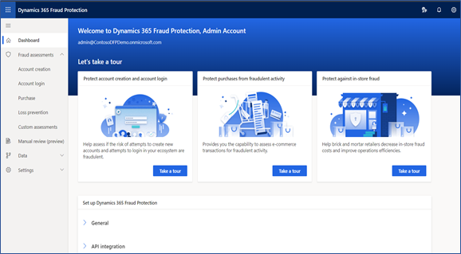

2.	On the **Purchase** page, select **Diagnose**, and then select **Upload required data**.
3. In the left navigation, select **Data**, select **Data upload**, and then select **Purchase protection**.
4.	On the **Data upload** page, select each type of data file that you want to upload (**Purchases**, **Purchase status**, **Bank events**, **Chargebacks**, **Refunds**, **Labels**, or **Accounts**).
5.  Select the type of file you want to upload (a .csv or .tst file), and then select **Browse**.

    The **Data upload page** displays a preview of your data.

7.  In the top navigation, select **Save and close**.
8. Repeat steps 2 through 4 to upload all four types of data.

9. After you've uploaded all your data files, select **Process purchase data**.
     
   Fraud Protection begins processing your data and building your loss prevention report.

    > [!NOTE]
    >Typically, it takes about 30 to 60 minutes to generate a report package. However, the actual length of time depends on the amount of data that was provided.

10. In the left navigation, select **Purchase** and then select **Diagnose** to see your report. To download a copy, select **Download report**.
   
### Analyze data in a loss prevention report

For more information about reports, see [Diagnose experience overview](./diagnose-experience.md).

### Upload historical data

Historical data is also known as *cold start data*.

1.	Sign in to the [Fraud Protection portal](https://dfp.microsoft.com/), then in the left navigation, select **Data**, select **Upload Data**, and then select **Purchase protection**.
2.	On the **Diagnose analysis data** page, select each data type that you want to upload 
(**Purchases**, **Purchase status**, **Bank events**, **Chargebacks**, **Refunds**, **Labels**, or **Accounts**)
5.  Select the type of file you want to upload (a .csv or .tst file), and then select **Browse**.

    The **Data upload page** displays a preview of your data.

7.  In the top navigation, select **Save and close**.
8.  Repeat steps 2 through 4 to upload other types of data.
9. After you've uploaded all your data files, select **Process purchase protection data**.
     
   Fraud Protection begins processing your data and building your loss prevention report.

    > [!NOTE]
    >Typically, it takes about 30 to 60 minutes to generate a report package. However, the actual length of time depends on the amount of data that was provided.

10. In the left navigation, select **Purchase** and then select **Diagnose** to see your report. 

    -  To download a copy, in the top navigation, select **Download report**.
    -  To check the quality of the data, in the top navigation, select **Check data quality**.
    -  To upload additional data, in the top navigation, select **Upload data**.    

For more information about how to upload historic data, see [Upload historical data for purchase protection](./data-upload.md).

## Step 2: Interpret diagnose data in diagnostic and risk reports

You can use either your own generated reports or Fraud Protection's sample reports to interpret the two reports that are generated during the diagnose experience.

-	To view reports that were generated from your own data, in the left navigation, select **Purchase**, select **Diagnose**, and then select **Diagnose report** or **Risk report**.
-	To view sample reports, in the left navigation, select **Purchase**, select **Diagnose**, and then select **View sample report**.

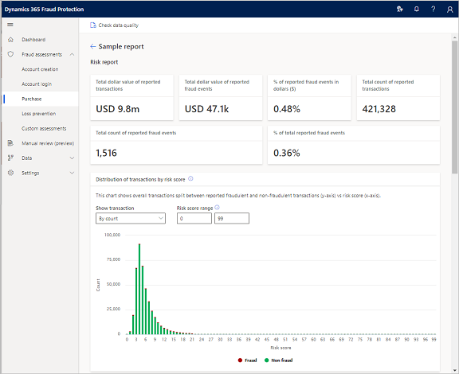

> [!NOTE]
>Sample reports are generated from synthetic sample data.

### Data diagnostic report – Summary

The data diagnostic report contains a detailed visual breakdown of your historical data and provides insights about how your data might help during fraud assessment. As for all ML/artificial intelligence (AI) models, the accuracy of the output is highly dependent on the quality of the data that goes into the models. The main purpose of this report is to provide a snapshot of the quality of your data and identify areas where the data has gaps or can be improved.

Before you can generate your risk diagnostic report, the key metrics of your data must reach a minimum quality threshold. If the quality of the data is too low to allow for accurate evaluation, we recommend that you try to fill in those gaps before you generate the risk diagnostic report.

You can download the data diagnostic report from the tool as a PDF file, and then share it with a broader audience or do offline analysis.

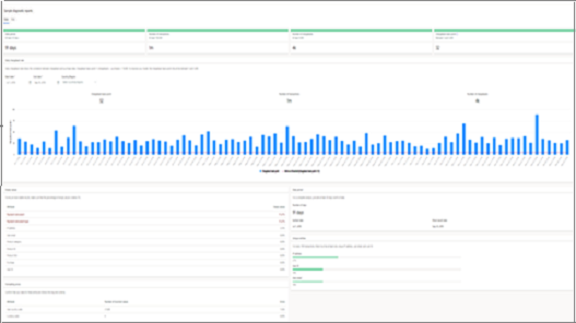

> [!NOTE]
> Sample reports are generated from synthetic sample data.

### Data diagnostic report – Details

This section describes each section of the data diagnostic report to help you learn how to interpret the report.

The following screenshot shows the top section of the data diagnostic report. This section provides the following information:

-	The **Date period** section shows the number of days' worth of data that is available on the report.
-	The **Number of transactions** section shows the number of transactions that are available on the report.
-	The **Number of chargebacks** section shows the number of chargebacks that are available on the report.
-	The **Chargeback basis point** section shows the chargeback basis point, which indicates the percentage of uploaded transactions that have an associated chargeback. The value is calculated as (Chargebacks ÷ Purchases) × 10,000.

 	One basis point equals 0.01 percent (one one-hundredth of 1 percent). Therefore, for the chargeback rate, a basis point of 500 means that 5 percent of uploaded transactions have an associated chargeback.

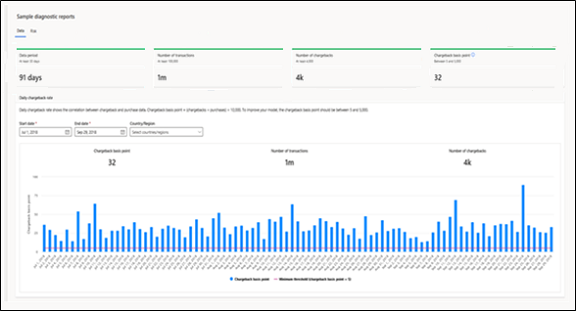

The next section of the report is the **Daily chargeback rate** section. This section provides the following information:

-	In the three fields above the chart, you can select the start and end dates to set the date range for the chart and select a country or region to view specific segments of your data for the selected date range.
-	In the daily chargeback rate chart, the red horizontal line represents the minimum threshold of 5 chargeback basis points (bps). This threshold is the minimum number of labels that are required for model training.

You should very rarely see a chargeback rate that is less than the threshold of 5 chargeback basis points (bps). However, if you do, you're either missing data or something is wrong with the data. In these cases, we recommend that you do further investigation to identify and fix the root cause.

The bottom section of the report provides an assessment of some aspects of the data that could affect the risk diagnostic report: empty data values, the period of the data, formatting errors, and uniqueness of the data. This section provides the following information:

-	The **Empty values** section provides an assessment of the completeness of your data and shows the percentage of values in the whole dataset that are empty. Fraud Protection ignores historical data that has a null value. Note that if too much of your historical data has a null value, it will affect model performance.
 	
 	When you look at the data diagnostic report, it's important that you review it in the context of your business scenarios. Here are a few examples that explain why:
 	
 	-	Your report shows that 15 percent of the values for the **BIN** attribute of the **PaymentInstrument** data field are empty. If 85 percent of the purchase transactions that are done with your business are credit card and debit card transactions, the remaining 15 percent of transactions don't require a bank identification number (BIN). Therefore, the percentage of empty values is accounted for. However, if 95 percent of your business's transactions are credit card and debit card transactions, the fact that 15 percent of the attribute values are empty indicates a problem.
 	-	Your report shows that 80 percent of the values for the **PayerStatus** or **IMEI** attribute of the **PaymentInstrument** data field are empty. However, because 30 percent of your payment transactions are done through PayPal or mobile payments, which typically use those attributes, you expect only 70 percent of the attribute values to be empty. Therefore, before you generate a risk diagnostic report, you must investigate why more values than expected are empty.
 	-	Your report shows that 50 percent of shipping address fields are incomplete. However, 80 percent of your business involves sales of physical goods that are shipped. The remaining 20 percent involves sales of digital goods. Therefore, because you know that 80 percent of your sales require a shipping address, you expect only 20 percent of shipping address fields to be incomplete.
  
-	The **Data period** section provides details about the data period that was used to generate the report. To generate a good directional indication in the risk diagnostic report, Fraud Protection requires at least 90 days' worth of historical data that meets data completeness and diversity criteria.
-	The **Formatting errors** section confirms that your data follows the required schema for the listed attributes. The information in this section is important because the specifications help ensure ML model performance.
 	For example, the schema that Fraud Protection uses requires a two-letter ISO country or region code, and a three-character currency code that is aligned with the OANDA currency code. If different codes are used for these attributes, there will be a 100-percent mismatch. However, in some cases, only a subset of the data has a formatting mismatch (as shown in the screenshot). This mismatch can be caused by errors that are introduced by some payment types or interface differences (web interface versus mobile app interface). Regardless, it's important that you understand the root cause of these formatting issues and fix them before you generate a risk diagnostic report.
-	The **Unique entities** section provides an assessment of the diversity of your data. It shows the percentage of unique data entities for **IP address**, **User ID**, and **User email** attributes. High diversity of data in these attributes enables good model performance and learning. These profiling entities are used to assess velocities for users. Fewer than one unique value for every 100 transactions (that is, a value of less than 1 percent) is a strong indicator of data mapping errors. In this case, you must investigate the issue and resolve it to help reduce the likelihood that the model's response will be skewed.

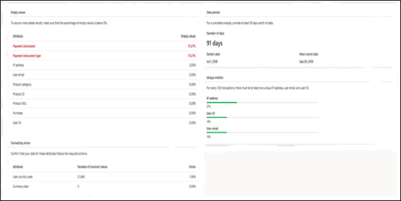

### Risk diagnostic report – Summary

The risk diagnostic report is generated after you've reviewed the data diagnostic report and made any data changes that are required. It helps you assess your risk from fraudulent activity and evaluate its monetary impact on your business.

Keep in mind that the risk diagnostic report is a historical analysis. Therefore, some real-time signals such as device fingerprinting can't be used in the assessment. Additionally, because of out-of-time analysis, the effect of the fraud protection network is also significantly limited.

Therefore, the scores that are shown won't be as good as they would be in a real-time assessment. However, this report provides a directional indication of the effectiveness of your fraud protection solution that uses Fraud Protection. Note that report performance will also be better when you use Fraud Protection in real time.

Instead of a "stopping **all** fraud (at all cost)" strategy, we recommend a strategy that is focused on **profit efficiency**. This type of strategy strikes a balance between the amount of fraud that is stopped and the number of false positives to optimize for the most profitable outcome. By approaching the issue in this way, you can get a much more efficient fraud system that can help deliver higher revenues and lower operating costs. The risk diagnostic report provides information and insights to help you analyze the trade-offs and understand the opportunity.

### Risk diagnostic report – Details

This section describes each section of the risk diagnostic report to help you learn how to interpret the report.

The following screenshot shows the top section of the risk diagnostic report. This section provides the following information:

-	The **Total dollar value of reported transactions** section shows the total dollar value of all transactions that are available in the data diagnostic report.
-	The **Total dollar value of reported fraud events** section shows the total dollar value of all reported fraud events that are available in the data diagnostic report.
-	The **% of reported fraud events in dollars ($)** section shows the dollar amount of fraud events as a percentage of the total dollar amount of all transactions. The value is calculated as (Total dollar value of reported fraud events ÷ Total dollar value of reported transactions) × 100.
-	The **Total count of reported transactions** section shows the total number/count of reported transactions that are available in the data diagnostic report.
-	The **Total count of reported fraud events** section shows the total number/count of reported fraud events that are available in the data diagnostic report.
-	The **% of reported fraud events** section shows the total count of reported fraud events as a percentage of the total count of reported transactions. The value is calculated as (Total count of reported fraud events ÷ Total count of reported transactions) × 100.

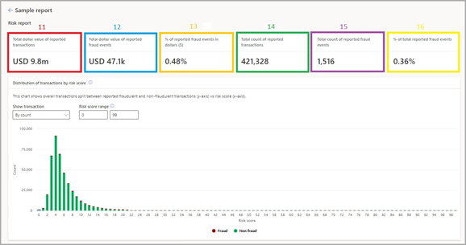

#### Distribution of transactions by risk score

In the next section of the report, low scores represent lower-risk transactions. You should always expect to see a "left-heavy," long-tail distribution; **not** a bell-curve or "right-heavy" distribution in the chart. A left-heavy distribution indicates that most of your transactions are low-risk and therefore will be recommended for approval by Fraud Protection. 

As the risk scores increase along the x-axis, you should expect to see fewer and fewer transactions in the score bins. If the chart shows a very different type of distribution, contact Microsoft.

This section provides the following information:

-	In the **Show transaction** field, you can select to view transactions by count or by currency value.
-	In the **Risk score range** fields, you can select the range of score bins. Note that, although the score (bin) range that is shown in the screenshot is from 0 through 99, the risk scores are in the range from 0 through 999.
-	The chart shows transaction distribution by risk score for the selected score range. Green represents good transactions, whereas red represents the reported fraudulent transactions.

#### Model performance

The next section of the report is named **Model performance**. It shows how the model performed, based on the data that was received. It provides the following information:

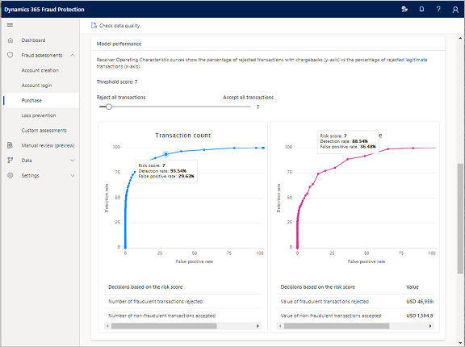

-	You can use the slider above the chart to select the risk score threshold that you want to analyze. Any transaction where the score is more than the threshold will be recommended for rejection.
-	The chart represents the receiver operating characteristic (ROC) curve. It shows the percentage of rejected transactions that have chargebacks (y-axis) versus the percentage of rejected legitimate transactions, also known as false positives (x-axis). This data is charted by transaction count on the left and transaction value on the right. The chart will always be a curve. However, notice how steeply the curve climbs, because the steepness indicates a high rate of fraud detection that involves a low number of false positives, which is the ultimate outcome. In an ideal scenario, you will observe a false positive rate of 1 percent. However, the actual rate depends on the cost of the loss of one item. For example:

    -	You're protecting a product that sells for $1,000, and your profit margin is $250.
    -	The cost of allowing a fraudulent transaction is $1,000 if you, as the merchant, are liable for fraud (as is often the case for online "card not present" transactions).
    -	The cost of a false positive is only $250.
    -	If you make 100 sales of the product, and there is no fraud, you make $100,000 in revenue and $25,000 in profit.
    -	If your fraud rate is 10 percent or 10 transactions, you make $90,000 in revenue, but your profit drops to $15,000, because the fraud has increased your cost of goods sold (COGS) by the amount that you lost.
    -	If stopping 70 percent of the fraud comes at the cost of stopping 1 percent of the good transactions, you end up with only three fraudulent transactions and 99 sales, or $99,000 in revenue and $21,750 in profit.
    -	If stopping 100 percent of the fraud comes at the cost of stopping 15 percent of the good transactions, you end up with no fraudulent transactions and 85 sales, or $85,000 in revenue and $21,250 in profit.
    -	Therefore, in this example, it's more profitable to allow a small amount of fraud to capture more good customer transactions.

 	> [!NOTE]
 	> These curves are generated from a historical analysis. When real-time assessment is introduced, the fraud detection rate (y-axis) will significantly improve.

-	The section below the chart shows the outcome of the selected threshold. It shows the number and value of fraudulent transactions that would have been rejected (known as true positives) versus the total number and value of reported fraudulent transactions. It also shows the ratio of the number and value of good transactions that were accepted (known as true negatives) to the total number and value of good transactions. When you’re interpreting the data, if there is high variability in the product prices, the transaction amount curve can be more valuable to your analysis. Also, if the **Transaction value** chart is higher than the **Transaction count** chart, there is a higher detection rate for high-value transactions. This result is good because those transactions can often incur the highest losses. If the **Transaction count** chart is higher than the **Transaction value** chart, there is a higher detection rate for lower-value transactions. This result can be good if there are very high volumes of low-value transactions.

#### Top 5 risk factors

-	At the bottom of the report, the **Top 5 risk factors** section shows the top-five risk factors for the selected percentage of your transactions that have the highest risk score. 

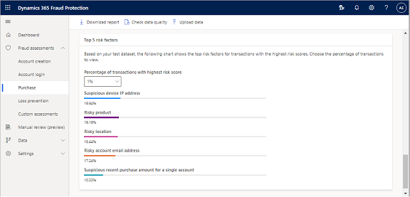

In the example that is shown, out of 1 percent of the riskiest transactions (that is, the transactions that have the highest risk scores, as assessed by Fraud Protection), 20 percent had a suspicious device Internet Protocol (IP) address, and 18.2 percent had a risky prepaid card. This section of the report is helpful because, by indicating which data attributes are showing the highest risk of being fraudulent, it can show where you should focus your fraud detection efforts.

## Step 3: Integrate purchase protection APIs

You can take advantage of the full suite of features in Fraud Protection by sending your transaction data to the real-time APIs.

-	In the evaluate experience, you can analyze the results of using Fraud Protection on your data.
-	In the protect experience, you can honor decisions that are based on the rules that you've configured for your data.

Depending on how you choose to use Fraud Protection, you can use different sets of APIs:

-	**Purchase protection APIs**: Purchase, PurchaseStatus, BankEvent, Chargeback, Refund, UpdateAccount, and Label
-	**Account protection APIs**: SignUp, SignUpStatus, and Label

For information about supported events, see Dynamics 365 Fraud Protection API.

### Sign in

> [!IMPORTANT]
> You must be a global administrator in your Azure tenant to complete the initial sign-in.

Visit the portal for each environment that you intend to use, sign in, and accept the terms and conditions if you're prompted.

-	**Sandbox** - https://dfp.microsoft-int.com
-	**Production** - https://dfp.microsoft.com

You might already have completed this step for the production environment during initial sign-up.

### Create Azure AD apps

> [!IMPORTANT]
> To complete this step, you must be an application administrator, a cloud application administrator, or a global administrator in your Azure AD tenant.

To acquire the tokens that are required to call the APIs, use Fraud Protection to configure Azure AD applications.

### Configure an Azure AD app

1.	In the [Fraud Protection portal](https://dfp.microsoft.com/), in the left navigation, select **Data**, and then select **API management**.
2.	On the **API management** page, select **Configuration**.
3.	Select **Creating applications**, and then fill in the fields to create your app.

    The following fields are required:

    -	**Application display name** – Enter a descriptive name for your app. The maximum length is 93 characters.
    -	**Environment** – Select the production endpoint.
    -	**Authentication method** – Select whether a certificate or a secret (password protected) is used for authentication.
    -	If you select **Certificate**, select **Choose file** to upload the public key. When you acquire tokens, you will need the matching private key.
    -	If you select **Secret**, a password is generated for you after the app is created.

4.	When you've finished filling in the fields, select **Create application**.
 	The confirmation page summarizes the app's name and ID, and either the certificate thumbprint or the secret, depending on the authentication method that you selected.

 	> [!IMPORTANT]
 	> Save the information about your certificate thumbprint or secret for future reference. This information will be shown only once.

### Create additional apps

You can create as many apps as you require to run API calls in your production environments.

1.	On the **Configuration** tab, select **Creating applications**.
2.	Fill in the fields to create your app, and then select **Create application**.

### Call the Fraud Protection real-time APIs

Use the information in this section to integrate your systems with Fraud Protection.

#### Required IDs and information

-	**API Endpoint** – The URI for your environment appears on the **Account information** tile on the Fraud Protection dashboard.
-	**Directory (tenant) ID** – The directory ID is the globally unique identifier (GUID) for a tenant's domain in Azure. It appears in the Azure portal and on the **Account information** tile on the Fraud Protection dashboard.
-	**Application (client) ID** – The application ID identifies the Azure AD app that you created to call APIs. You can find this ID on the confirmation page that appears after you select **Create application** on the **API Management** page. You can also find it later, under **App registrations** in the Azure portal. There will be one ID for each app that you create.
-	**Certificate thumbprint or secret** – You can find the certificate thumbprint or the secret on the confirmation page that appears after you select **Create application** on the **API Management** page.

#### Generate an access token

You must generate this token and provide it with each API call. Note that access tokens have a limited lifespan. We recommend that you cache and reuse each access token until it's time to get a new one.
The following C# code samples show how you can acquire a token by using your certificate or secret. Replace the placeholders with your own information.

**Certificate thumbprint**

```json
   public async Task<string> AcquireTokenWithCertificateAsync()
     {
          var x509Cert = CertificateUtility.GetByThumbprint("<Certificate thumbprint>");
          var clientAssertion = new ClientAssertionCertificate("<Client ID>", x509Cert);
          var context = new AuthenticationContext("<Authority URL. Typically https://login.microsoftonline.com/[Directory_ID]>");
          var authenticationResult = await context.AcquireTokenAsync("<API endpoint>", clientAssertion);

          return authenticationResult.AccessToken;
     }
```

**Secret**

```json
   public async Task<string> AcquireTokenWithSecretAsync()
     {
       var clientAssertion = new ClientCredential("<Client ID>", "<Client secret>");
       var context = new AuthenticationContext("<Authority URL. Typically https://login.microsoftonline.com/[Directory_ID]>");
       var authenticationResult = await context.AcquireTokenAsync("<API endpoint>", clientAssertion);

       return authenticationResult.AccessToken;
   }
```

**Response**

Behind the scenes, the preceding code generates an HTTP request and receives a response that resembles the following example.

```json
   HTTP/1.1 200 OK
   Content-Type: application/json; charset=utf-8
   Date: <date>
   Content-Length: <content length>

   {
    "token_type":"Bearer",
    "expires_in":"3599",
    "ext_expires_in":"3599",
    "expires_on":"<date timestamp>",
    "not_before":"<date timestamp>",
    "resource":"https://api.dfp.dynamics.com",
    "access_token":"<your access token; e.g.: eyJ0eXA...NFLCQ>"
   }
```

For more information about access tokens, see the following Azure documentation:

-	[Use client assertion to get access tokens from Azure AD](/azure/architecture/multitenant-identity/client-assertion)
-	[Cache access tokens](/azure/architecture/multitenant-identity/token-cache)

#### Call the APIs

1.	Pass the following required HTTP headers on each request.

| Header name	| Header value|
|----------------|------------------|
| Authorization	| <p>Use the following format for this header: Bearer *accesstoken*</p><p>In this format, accesstoken is the token that is returned by Azure AD.</p>| 
| x-ms-correlation-id	| Send a new GUID value on each set of API calls that are made together.| 
| Content-Type	| application/json| 

2.	Generate an event-based payload. Fill in the event data with the relevant information from your system. For information about supported events, see [Dynamics 365 Fraud Protection API](https://go.microsoft.com/fwlink/?linkid=2084942).
3.	Combine the header (which includes the access token) and the payload, and then send them to your Fraud Protection endpoint. (The API endpoint is the URI for your environment and appears on the **Account information** tile on the Fraud Protection dashboard.)

For more information about APIs, see [Dynamics 365 Fraud Protection API](https://apidocs.microsoft.com/services/dynamics365fraudprotection).

## Step 4: Understand purchase events

You use APIs to send risk evaluation events to Fraud Protection. These events build up information about the purchases that customers make, and they recommend that merchants either approve transactions or reject them because of fraud.

-	For integration and testing, use the following endpoint: https://api.dfp.microsoft-int.com/
-	For production, use the following endpoint: https://api.dfp.microsoft.com/

For information about the required and optional fields, and their definitions, see [Dynamics 365 Fraud Protection API](https://apidocs.microsoft.com/services/dynamics365fraudprotection).

## Step 5: Use common support tool and graph explorer scenarios

This section uses support tool and graph explorer scenarios to increase your familiarity with the following features:

-	[Search for a user in the support tool](promocode-set-up-purchase-protection.md#search-for-a-user-in-the-support-tool)
-	[Block a user in the support tool](promocode-set-up-purchase-protection.md#block-a-customer-or-payment-instrument-in-the-support-tool)
-	[Unblock a customer or payment instrument in the support tool](promocode-set-up-purchase-protection.md#unblock-a-customer-or-payment-instrument-in-the-support-tool)
-	[Search for a user in the graph explorer](promocode-set-up-purchase-protection.md#search-for-a-user-in-the-graph-explorer)
-	[Verify a purchase transaction in the graph explorer](promocode-set-up-purchase-protection.md#verify-a-purchase-transaction-in-the-graph-explorer)

For ease of explanation, screenshots in the description of each scenario are based on the demo data. When you load your own data into the system and use it to go through these scenarios, replace search fields with one of your customers or purchase transactions.

### Search for a user in the support tool

The Fraud Protection support tool lets your agents evaluate customer escalations, unblock customers whose purchase attempts are being incorrectly declined, and block future purchases from suspicious users, as appropriate. Your fraud investigators can search and investigate the history of your customers' past transactions with your business. Therefore, they can provide faster turnaround for decisions.

1.	In the left navigation, select **Purchase**, and then select **Support**.
 	In this example, you will search for a user who has the username manu@contoso.com, and you will change the transaction period to show several transactions.
2.	In the search field, enter **manu@contoso.com**, and then, in the first date field, select **Jan 1, 2019**.
 	
 	There are two tabs in the search results. One tab contains information about accounts, and the other contains information about transactions that are associated with the accounts.

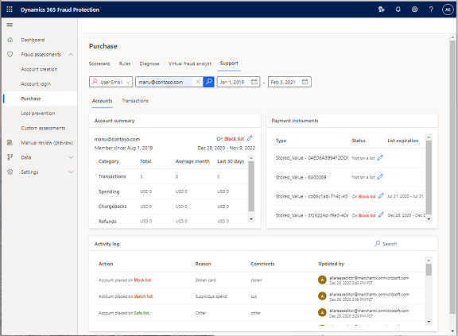

By default, the **Accounts** tab is selected. It shows the following information:

  -	The **Account summary** section summarizes the history of the customer's spending, transactions, chargebacks, and refunds, if there is any history. Scroll down the list to view more information. When your own data is loaded into the support tool, look for activities that might fall outside typical patterns, such as a recent spike in spending, or an unusual number of transactions or chargebacks. This section also indicates whether the user is on a safe list, block list, or watch list.
  -	The **Payment instruments** section lists any payment instruments that have been associated with the account. It also indicates whether the payment instruments are on a safe list, block list, or watch list.
  -	The **Activity log** section logs user and payment instrument activity, such as when they are added to or removed from a list.

3.	Select the **Transactions** tab, and then, in the **Transaction history** section, select a transaction.

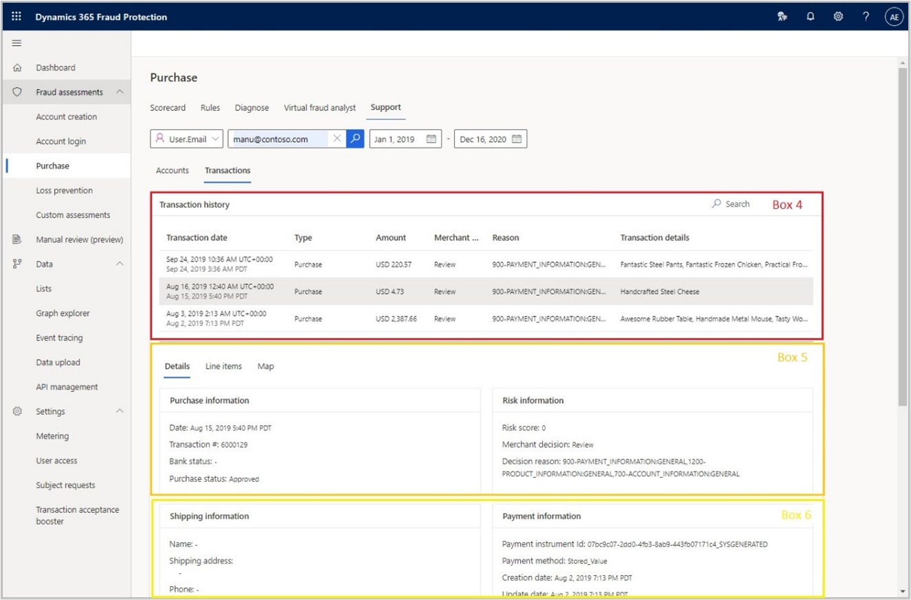
 	
The **Transactions** tab shows the following information:
 	
   -	The **Transaction history** section lists individual transactions and highlights their key properties.
   -	By default, the **Details** tab is selected. It shows details about individual transactions, such as the payment method, the device that was used, and the originating IP address.
      The first two sections on the **Details** tab are named **Purchase information** and **Risk information**.

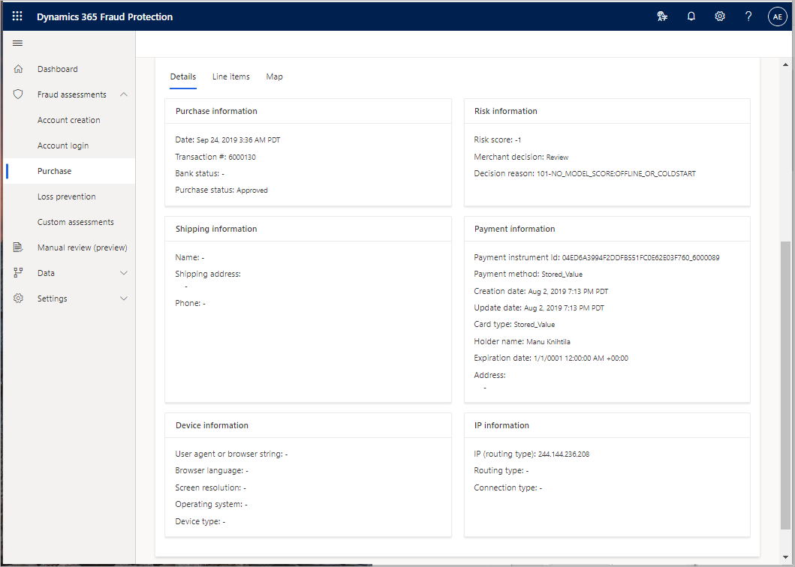

- The **Purchase information** section shows purchase-related data, such as the date and time of the transaction, the transaction number, the bank status, and the purchase status. Note that the transaction number is an ID that you will create and send to Fraud Protection. The ID format isn't specified by Fraud Protection. It can be in any format that you prefer, such as a GUID or string.
-	The **Risk information** section shows several important pieces of information that are related to the transaction, such as its risk score, the merchant decision, and the decision reason. The merchant decision that is shown is based on the rules stack that is configured by the merchant. Fraud Protection decision reasons are codes that help your customer support agents quickly identify the reason behind Fraud Protection's recommendation for the transaction, so that they can take appropriate action. During the trial phase, you receive only group-level codes. However, after you're in Protect mode, you will receive unique codes that provide reason information at a more granular level. For more information about Fraud Protection decision reasons, see the product documentation.
 	
The next two sections on the **Details** tab are named **Shipping information** and **Payment information**. They show the shipping-related and billing-related information that were used when the purchase event occurred.
 	
The last two sections on the **Details** tab are named **Device information** and **IP information**.

-	The **Device information** section shows information that was captured by Device Fingerprinting. If Fraud Protection Device Fingerprinting isn't implemented (for example, in the case of historical data), this section will remain blank.
-	The **IP information** section shows the IP address, the physical location where the purchase was made.

4.	Select the **Line items** tab.

    This tab itemizes everything that was purchased during the selected transaction. It shows the prices, applicable taxes, and fees.

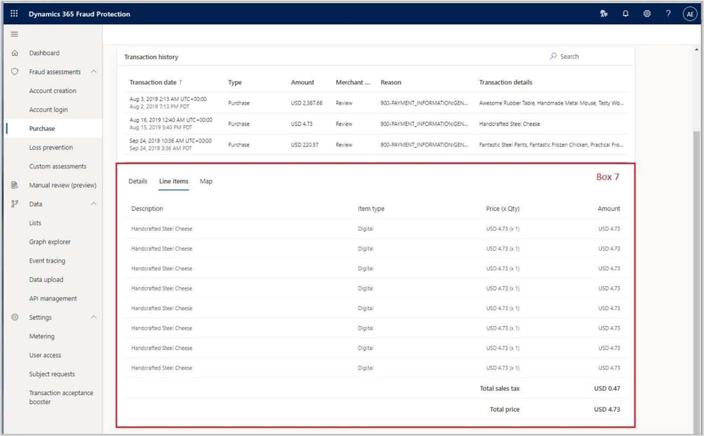

5.	Select the **Map** tab.

    The transaction map lets you view the shipping address and billing address in relation to each other if both addresses were provided in the dataset. Select one of the addresses to center it on the map. If the addresses match, the pins for the two addresses will overlap.

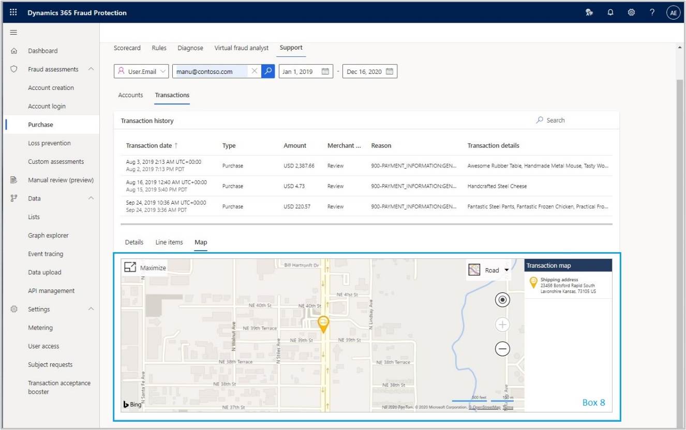

For more information about how to use the support tool, see [Support your customers with Dynamics 365 Fraud Protection](./risk-support.md).

### Block a customer or payment instrument in the support tool

On the **Accounts** tab, you can add a user to the Accounts summary section and the associated payment instruments to the Payment instruments section (highlighted in the screenshot below).


#### Use lists and rules to drive actions

In Fraud Protection, lists and rules are used together to drive tailored actions. Rules shape real-time decision making by accepting or rejecting transactions, based on conditions and risk score thresholds that you select. The rules use lists, such as a *safe list*, a *block list*, and *custom lists* of data that are relevant to your business. These capabilities help you define and screen for risky transaction types. They also help you enforce various policies, such as geofencing. In general, they help you manage the trade-offs that are inherent when you must prevent fraud but also minimize false positives.

For more information about how to create and use lists and rules, see [Manage lists](./lists.md) and [Manage rules](./rules.md) in the product documentation.

#### Block a customer

In the support tool, you can easily modify the default safe, block, and watch lists. By default, all customers are on the safe list. However, if a concern is raised, you can block a customer for a specified period.

1.	On the **Support** tab, on the **Accounts** tab, in the **Payment instruments** section, select **Status**, and then select **Block list**.
2.	In the **Reason** field, enter a reason, such as **Stolen card**.
3.	In the **Expiry date** field, set a future expiry date.
4.	Enter a comment, select **Submit**, and then select **Yes** to continue.

    A message in the **Activity log** section indicates that the user has been successfully blocked. Additionally, the text **On block list** and the block period appear to the right of the user's email address.

#### Block a payment instrument

You can block a payment instrument by following the same steps after you click to the right of one of the payment instruments.

1.	On the **Support**, on the **Accounts** tab, in the **Payment instruments** section, select **Status**, and then select **Not on a list**.
2.	In the **Reason** field, enter a reason, such as **Stolen card**.
3.	In the **Expiry date** field, set a future expiry date.
4.	Enter a comment, select **Submit**, and then select **Yes** to continue.

### Unblock a customer or payment instrument in the support tool

#### Unblock a customer

1.	On the **Support** tab, on the **Accounts** tab, to the right of the user's email address, select **On Block list**.
2.	Select **Remove from lists**.
3.	Enter a comment, such as **Account rehabilitated**, select **Submit**, and then select **Yes** to continue.

    A message in the **Activity log** section indicates that the user has been successfully unblocked. Additionally, as the text **Not on a list** appears to the right of the user's email address.

### Search for a user in the graph explorer

The graph explorer helps you understand the connections between data, search for specific data points, and view the attributes of data points.

1.	In the left navigation, select **Data**, and then select **Graph explorer**.
2.	In the search field, enter a user email address, such as **manu@contoso.com**.
 	The purchases that are associated with the user appear.
3.	Double-click the **Purchase** circle to expand the purchases that the user has made.
4.	Hover over any entity in the graph to show a summary of that entity.
5.	Select an entity, such as **User**, to open a pane that shows the entity's associated attributes and values.

### Verify a purchase transaction in the graph explorer

The information and the linkages in the graph can be used for activities such as forensics. One simple form of forensics would be to verify a transaction.

1.	In the left navigation, select **Data**, and then select **Graph explorer**.
2.	In the drop-down list, select **Purchase.PurchaseID**, and then enter a valid purchase ID, such as **6000345**.
 	
    This purchase ID is for a purchase that Rohana made. As the following screenshot shows, a lot more information is available about Rohana's transaction than was available for Manu in the previous section.
 	
3.	Select the **Product** node to show details about the purchase.
4.	A pane on the right of the **Graph explorer** page shows details about the purchase.

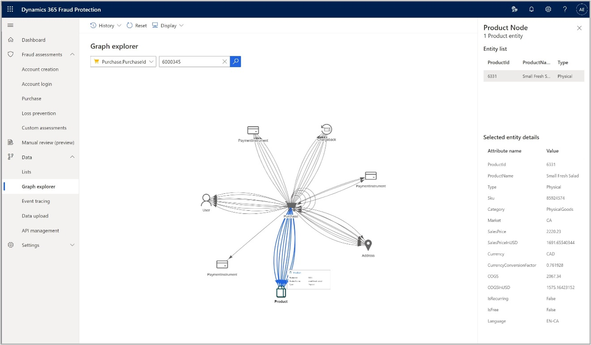

The **Product Node** pane on the right of the **Graph explorer** page displays details of the purchase.

For more information about how to use the graph explorer, see [Visually explore data with the graph explorer](./graph-explorer.md).

Congratulations! You have successfully completed the training and are ready to use Fraud Protection's purchase protection capabilities.

## Next steps

For information about how to access and use Fraud Protection's features, see the following documents:

- [Set up device fingerprinting](device-fingerprinting.md)
- [Set up customer accounts protection](promocode-set-up-account-protection.md)
- [Set up loss prevention](promocode-set-up-loss-prevention.md)
