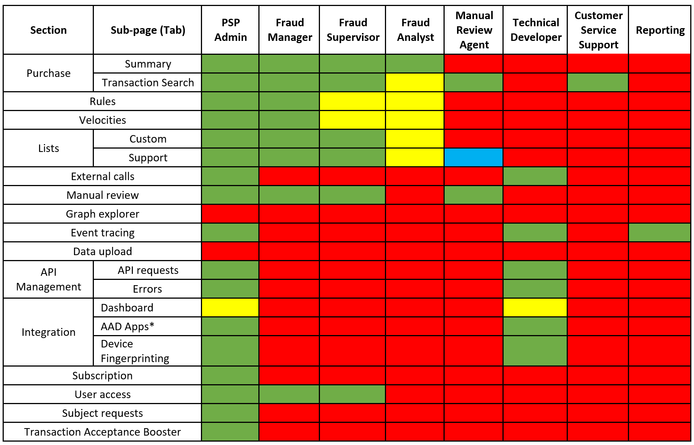

# User roles and access (PSPs)
[!include [preview banner](includes/preview-banner.md)]

Payment service providers (PSPs) can grant users of Dynamics 365 Fraud Protection various levels of access based on logical or functional roles.

## Assign PSP roles 

The administrator who is defined in the Azure tenant initially creates users in the tenant. Then, they can assign Fraud Protection roles from within the Fraud Protection portal. For information about how to add users to Azure Active Directory, see [Create a user account in Azure Active Directory](/azure/active-directory/manage-apps/add-application-portal-assign-users#create-a-user-account).

### Assign PSP roles to users in Fraud Protection
After a user has been added to the PSP's Azure Active Directory (Azure AD), you can assign them a PSP role in Fraud Protection. 

1. Go to the Fraud Protection portal page.
1. In the left navigation pane, select **Settings**, and then select **User access**. 
1. Select **Assign role(s)**. 
1. Enter the name or company email address of the person or group that you want to assign a Fraud Protection PSP role to. 

    If the name is recognized as a member of the Azure tenant, the name will resolve to the full name. 

1. Select the name. 
1. In the **Roles** field, select one or more of the defined roles you'd like to assign to the user. 
1. Select **Assign role** under the role you selected. The user is added to the Fraud Protection environment you're using. 

### Edit assigned role or delete users

To edit the role assigned to a user in Fraud Protection or to delete a user, select the user name in the **Member** list, and then select either **Edit** or **Remove**. 

   On this part of the page, roles can be added to or deleted from a user. If you edit your own account (for example, if you delete your own administrative role), your edits may interfere with your ability to use some features of Fraud Protection. If you must restore permissions, you can reset them in the [Azure portal](https://portal.azure.com/#home). 

To learn more about the available PSP roles, see the [PSP user roles and access](psp-user-roles.md#psp-user-roles-and-access) section of this topic. 

### User management in your Azure tenant 

Users and roles can also be managed through the Azure portal. For information about how to grant access to users through the Azure portal, see [Assign a user account to an enterprise application](/azure/active-directory/manage-apps/add-application-portal-assign-users#assign-a-user-account-to-an-enterprise-application). 

## PSP user roles and access 

Fraud Protection offers a defined set of user roles, each of which has access to specific features and functions. You can select the features and functions when you assign a user to the system. 

>[!NOTE]
>To create an Azure AD application, the user assigned "PSP Admin" or "Technical Developer" role must also be assigned "Application Administrator", "Cloud Application Administrator", or "Global Administrator" in your Azure tenant.

The following roles are available for PSP users.

- **PSP Admin** - This role provides the highest level of authority and can manage Fraud Protection for a PSP and their merchant customers. It is a high-level administrative account with full access to all of the PSP related features. 

- **Fraud Manager** - This is an internal role within the PSP. The user in this role is intended to manage Fraud Protection for a PSP's customer merchants.

- **Fraud Supervisor** - This role provides the highest level of authority within a PSP's customer merchant and can access merchant-facing functions delegated to them by the PSP.

- **Fraud Analyst** - This role is intended for a PSP's customer merchant who will run analysis and reports with read-only access to a customer merchant's data.

- **Manual Review Agent** - This user is responsible for reviewing individual transactions and approving or declining them. A Manual Review Agent does not have direct access to the **Support Lists** page, but can modify the status of an entry in the support list through the **Transaction Search** page. 

- **Technical Developer** - The user in this role is responsible for managing the technical configurations and integrations of a Fraud Protection instance for the PSP. 

- **Customer Service Support** - The user with this role can view the transaction details and is provided with information needed to handle customer queries.

- **Reporting** - This role only provides access to event tracing to allow Fraud Protection events and data to be consumed into the PSP's internal reporting infrastructure. 

## Additional resources

[Configure user access](configure-user-access.md)

[Create a user account in Azure Active Directory](/azure/active-directory/manage-apps/add-application-portal-assign-users#create-a-user-account)

[Assign a user account to an enterprise application](/azure/active-directory/manage-apps/add-application-portal-assign-users#assign-a-user-account-to-an-enterprise-application). 

[!INCLUDE[footer-include](includes/footer-banner.md)]
