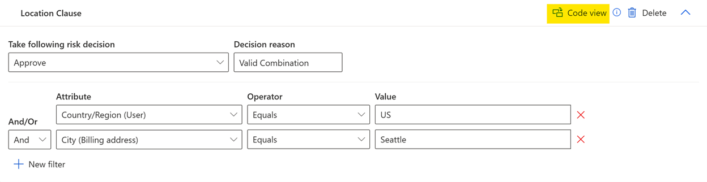
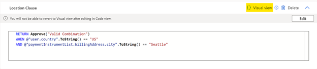

# Manage rules 

Microsoft Dynamics 365 Fraud Protection gives you the flexibility to create rules that use the score that Fraud Protection's state-of-the-art artificial intelligence (AI) model generates, together with additional parameters from the request payload. Based on these inputs, rules can convert an assessment into a decision, such as **Approve**, **Reject**, **Review**, or **Challenge**.

If your Fraud Protection instance has multiple environments, you can manage rules in a specific environment by using the environment switcher. If the environment has parent environments, the rules in the top-level parent environment will be evaluated first. If the rule settings for the top-level parent environment are set to **Run all matching rules until a decision is made**, the rules in the second-level parent environment will be evaluated next. This process continues unless the rule settings for an environment are set to **Run only the first matching rule**, or until all the rules for the parent environment and the current environment have been evaluated.  

## Defining a rule: Quick start guide

Rules consist of clauses, and are defined by the **RETURN** and **WHEN** keywords. They have the following basic structure.

```FraudProtectionLanguage
RETURN <decision>
WHEN <condition>

```
The RETURN statement will only be executed if the WHEN statement evaluates to True. The RETURN statement will terminate rule execution and must specify a valid decision function: *Approve*, *Reject*, *Challenge*, or *Review*. Each decision function also accepts an optional parameter, allowing you to express the *reason* for the decision. To learn more, see [Decision functions](fpl-lang-ref.md#decision-functions). 

In addition to a decision, the RETURN statement can also be used to write data to the API response or to event tracing. To learn more, see [Observation functions](fpl-lang-ref.md#observation-functions). 

The WHEN statement specifies a Boolean condition, which determines if the RETURN statement will execute. 

The WHEN statement can utilize any of the following:

-	Any attributes that are sent in the API request for the assessment, including custom data. You can access these attributes with the @ operator. For example, @"user.userId".
-	The scores that are generated from Fraud Protection's artificial intelligence models. For example, @"riskscore".
-	Lists which you have uploaded to Fraud Protection. For more information on how to upload lists, see [Manage lists](lists.md). For more information on referencing these lists in your rules, see [Using Lists in rules](fpl-lang-ref.md#using-lists-in-rules).
-	Velocities which you have defined in Fraud Protection. For more information, see [Perform velocity checks](velocities.md).
-	External calls which you have created in Fraud Protection. For more information, see [External calls](external-calls.md). 

Expressions can be compared using comparison operators (such as ==, !=, >, <), and can be combined using logical operators such as **and** (&&) and **or** (||).

For more information on rule syntax, see the [Language reference guide](fpl-lang-ref.md).

## Visual view

Use visual mode to write rules quickly and easily using the attributes from the request payload. 

1. To create visual rules, select **+ New Clause**.
2. Select **Visual View** next to the clause name.  
3. You can add multiple filters to the clause and choose the attributes from the drop-down menu.  
4. Switch back to the **Code View** to view and edit the rules in the Fraud Query Language. After the rule is edited in the **Code View**, you can't go back to the **Visual View**. 

  The following graphic shows the **Visual View** of the rules and the **Code View** button you can select to change the view.
  
   

  The following graphic shows the **Code View** of the rules and the **Visual View** button you can select to change the view.

   

### Examples of rules

```FraudProtectionLanguage
RETURN Reject("high score")
WHEN @"riskScore" > 900

```

```FraudProtectionLanguage
RETURN Review("medium score")
WHEN @"riskScore" <= 900 and @"riskScore" > 400

```

```FraudProtectionLanguage
RETURN Approve(), Other(ip=@"device.ipAddress")
WHEN @"user.countryRegion" == "US"

```

```FraudProtectionLanguage
RETURN Reject("user on block list")
WHEN ContainsKey("Email Block List", "Emails", @"user.email")

```

```FraudProtectionLanguage
RETURN Review()
WHEN @"user.email".EndsWith(“@contoso.com”)

```

## Rules tab

You can create custom rules and manage existing rules on the **Rules** tab.

- To create and manage rules that are related to purchases, select **Purchase**, and then select the **Rules** tab.
- To create and manage rules that are related to accounts, select **Account creation** or **Account login**, and then select the **Rules** tab.
- To create and manage rules that are related to a custom assessment, select **Custom assessments**, select a custom assessment, and then select the **Rules** tab.

The **Rules** tab shows a list of the rules that have been configured for an assessment type. These rules are divided into two sections: **Published Rules** and **Drafts**. For information about drafts, see the [Drafts](rules.md#drafts) section later in this article.

You can view the following information for each rule or draft:

- The [name](rules.md#name-and-description)
- The [condition](rules.md#conditions) that you created
- The [status](rules.md#status): **Active** or **Inactive**

You can also select the tile for each rule to expand it and show additional information. Here are some examples:

- The [description](rules.md#name-and-description)
- The number of [clauses](rules.md#clauses) in the rule
- Who last updated the rule
- When the rule was last updated


> [!NOTE]
> On the **Rules** tab, published rules are listed in the order that they are run in.

### Rule settings

You can access the rule settings on the **Rules** tab for a specific assessment. There, you can change the rule evaluation behavior and the sample payload. Note that these changes apply to rules only for the assessment that you're editing. 

### Rule evaluation behavior

You can update how your rules are evaluated. If you select **Run the first matching rule**, only one rule will ever be evaluated per transaction. If that rule doesn't return a decision, no further rules will be evaluated, and a default decision of *Approve* is returned. If you select **Run all matching rules until a decision is made**, multiple rules can be evaluated for a single transaction. If the first rule that is evaluated doesn't return a decision, each subsequent matching rule will be evaluated until a decision is returned. 

### Sample payload

In the **Payload settings** pane, you can define the sample payload for the assessment type. The sample payload is intended to contain an example of the fields that will be sent in the request API for the assessment and can be used in your rule.

In the API request, you might choose not to send optional fields from the assessment schema. Alternatively, you might choose to send additional custom fields. In both cases, be sure to update the payload sample that is shown in the **Payload settings** pane, so that it reflects the specific fields that you're sending.

This payload sample is shown every time that a new rule is created for the assessment (see the [Payload sample](rules.md#payload-sample) section later in this article). Note that any changes that you make apply only to rules that you create from that time onward.

To undo all changes that you or other people have made to the payload sample, and return it to the system's default payload sample, select **Revert**.

## Branches

Branches allow you to safely modify rules without impacting what is happening in production. You can create branches on the rules tab, where each branch represents a collection of rules. The default branch is the **Production** branch, which is the branch of rules that is executed whenever traffic is sent to an assessment. 

### Creating a branch

To create a new branch, go to **branch action** -> **create a new branch**. You can name the branch, provide an API name, and select which rules you'd like to copy over from the source branch. The source branch is whatever branch you were on when you clicked on create a new branch, production or otherwise. No drafts are preserved on branch creation. 

### Modifying rules within branches

Any rule changes to non production branches **do not** affect the production rule stack. You can edit rules just like normal, and publish them to the branch, where they can be seen by everyone who has access to the rules page.

### Testing and Experiments

There are two ways to test branch rule behavior: Sending traffic directly to a branch and shadowing production traffic.

#### Sending traffic directly to a branch

You can send test traffic directly to a specific branch in an assessment using the branch API endpoint found under **branch actions** -> **branch information**. This API endpoint uses the same payload structure as the assessment, and will execute the rule stack of the branch. 
> [!NOTE]
> Sending traffic directly to a branch has no impact on production, so velocities will not be updated and branch transactions will not be visible in search.

#### Shadowing production traffic

You can also test branch rule behavior by shadowing production traffic. To do this, set up and start an experiment for a branch by clicking on the **Run experiment** button. Once an experiment is in progress, you can view its perfomance on the **Monitoring** tab by switching to the branch the experiment is running in. Once an experiment is in progress, its parameters cannot be edited. You can always stop an experiment to make changes and start it again. 
> [!NOTE]
> Shadowed traffic that executes on the branch rule stack will not have any impact on production, so velocities will not be double updated as a result of the shadow, only updated once as a result of the production execution. 

### Promoting branches to production

If you would like to make a branch the new production branch, you can do so by promoting a branch to production. The promotion action can be found under **branch actions** -> **promote to production**. This action will make the current branch you are promoting the new production branch. You will have the option to clone the existing production rules in a new branch to save them for reference. Drafts are preserved if the option to clone is selected. Once the promotion completes, the production branch is updated to contain the rules of the promoted branch.

> [!NOTE]
> The first time you promote a branch to production for a given assessment, you will not be able to clone the existing production rules in a new branch. If you want to save the existing production rules the first time you ever promote, make a new branch from production with those rules to preserve existing production rules. 

## Components of a rule

A rule consists of the following components:

- A [name and description](rules.md#name-and-description) that describe the purpose of the rule
- The current [status](rules.md#status) of the rule: **Active** or **Inactive**
- A [sample](rules.md#samples) of fields, to help you write and evaluate the rule
- Components that help you build the logic that automatically approves, rejects, challenges, or reviews events:
    - A [condition](rules.md#conditions)
    - One or more of the following types of [clauses](rules.md#clauses):
        - [Prior to all scoring clauses](rules.md#prior-to-all-scoring-clauses)
        - [Post-bot-scoring clauses](rules.md#post-bot-scoring-clauses)
        - [Post-risk-scoring clauses](rules.md#post-risk-scoring-clauses)

A published rule can also have a [draft version](rules.md#drafts).

### Name and description

When you create a rule, you can add a name and description to help yourself and your team easily identify the rule. Rule names must be unique, and they are case-insensitive.

### Status

When you first create a rule, before it's published, the status is set to **Draft only**.

When you publish a rule, you can set the status to either **Active** or **Inactive**.

- If a rule is active, it affects real-time production traffic, and all events are evaluated against the rule.
- If a rule is inactive, it doesn't affect production traffic.

When you edit a previously published rule, the rule is saved with a status of either **Active (with Draft)** or **Inactive (with Draft)**, depending on the status of the published rule.

### Samples

When you create or edit a rule, the **Sample** pane appears on the right side of the page. This pane has two sections: one for the *payload sample* and one for the *score sample*.

To view the sample variables that are used in your rule, select **Show used variables**.

#### Payload sample

The payload sample contains an example of the fields that can be sent in the request API for the assessment, as defined in the [**Payload settings** pane](rules.md#rule-settings). These fields can be used as variables in your rule.

#### Score sample

The score sample contains scores that are generated from Fraud Protection's AI models. You can reference score variables in rules after you run the associated AI model and generate the score. For example, you can use *@"botScore"* after the bot evaluation has been run, and you can use *@"riskScore"* after the risk evaluation has been run. For more information, see the [Clauses](rules.md#clauses) section later in this article.

#### Editing the sample

To verify that your rule works for a variety of events, you can edit the sample as you require and then [evaluate](rules.md#evaluation-example) the sample data against the rule. All values in both the payload sample and the score sample can be edited. When you edit a sample, the changes don't affect which data you send (or don't send) to Fraud Protection.

When you publish a rule, any changes that you've made to the sample are saved and persisted as part of the rule.

To undo all changes that you or other people have made to the sample, select **Revert**. The score sample will be reverted to the system's default score sample, and the payload sample will be reverted to the user-defined payload sample in the [**Payload settings** pane](rules.md#rule-settings).

### Conditions

Conditions start with the keyword **WHEN** and are followed by a Boolean expression that evaluates a statement to either **True** or **False**. A condition can be created to determine which rule is evaluated and to group related business logic. For example, the following condition is related to digital product transactions.

```FraudProtectionLanguage
WHEN @"productList.type" == "Digital"
```

You can then create clauses that configure a fraud strategy that is related to digital product transactions.

The addition of a condition to a rule is optional. If you want a rule to apply to all events, don't add a condition. For information about how to use conditions to order rules, see the [Rule ordering](rules.md#rule-ordering) section later in this article.

### Clauses

Clauses contain the fraud logic and business policies that are relevant to the segment of traffic that is defined in the condition. Clauses use values in the event payload together with Fraud Protection's AI scores to accept, reject, review, or challenge events. Each rule must contain at least one clause, and each a unique name is assigned to each clause. You can select the name to customize it.

Clauses have the following basic structure.

```FraudProtectionLanguage
RETURN <decision> 
WHEN <condition is true>
```

You can use this structure to create a clause that returns a decision of **Approve**, **Reject**, **Challenge**, or **Review**. You can then add optional parameters that send more information about the decision.

Everything after the **WHEN** keyword must be able to be evaluated to either **True** or **False**. This Boolean expression can consist of values from the [event payload](rules.md#clauses), [user-defined lists](lists.md), and [AI-based bot and risk scores](rules.md#post-bot-scoring-clauses).

For information about the syntax for clauses, see the [Language reference guide](fpl-lang-ref.md).

When a clause is triggered (that is, when the **WHEN** statement returns **True**), the decision that is specified in the **RETURN** statement is returned, and no subsequent clauses are run.

If a condition matches the decision but doesn't trigger a clause, the rule is then run.

```FraudProtectionLanguage
RETURN Approve("NO_CLAUSE_HIT")
```

Clauses are run sequentially in the order in which they appear on the **Rules** tab. You can use the arrow buttons on the right side of a clause to change its position in the list.

Clauses are organized into sections. AI models are run based on these sections and generate a score as part of the assessment. The sections differ per assessment and indicate when the clause is run relative to the AI model.

- For purchase protection, an AI risk model is run that generates a risk score for the transaction. Therefore, these rules contain both prior-to-all-scoring clauses and post-risk scoring clauses.
- For account protection, a bot model is run in addition to a risk model. These models generate a bot score and risk score, respectively. Therefore, these rules contain prior-to-all-scoring clauses, post-bot-scoring clauses, and post-risk-scoring clauses.
- For custom assessments, no AI models are run, and these rules contain only prior-to-all-scoring clauses.
- Assessments created using the [Assessment wizard](assessment-create-new.md#assessment-wizard-overview) don’t have a concept of prior-to-scoring and post-scoring clauses.  Instead, all clauses are executed sequentially (top to bottom) based on the order they are listed in the rule.

#### Prior-to-all-scoring clauses

Prior-to-all-scoring clauses are run before Fraud Protection's AI models are run. Therefore, they are run before any bot or risk assessment scores have been generated. These clauses can use any combination of fields that are sent as part of the event payload and contained in [lists](lists.md). They can be configured to implement embargo, geofencing, or other business policies.

The following example helps you review purchases when users buy a product in a market outside their geographical location.

```FraudProtectionLanguage
RETURN Review("location inconsistency") 
WHEN Geo.MarketCode(@"device.ipAddress") != "@productList.market"
```

In this section, you can also write a clause to cross-reference lists. For example, if you have a custom list that is named **Risky Emails**, the following clause rejects events if the user's email address appears in the list.

```FraudProtectionLanguage
RETURN Reject ("risky email") 
WHEN ContainsKey ("Risky Emails", "Emails", @"user.email")
```

For information about the syntax that is used to reference lists in rules, see the [Language reference guide](fpl-lang-ref.md).

#### Post-bot-scoring clauses

Post-bot-scoring clauses are run after Fraud Protection's AI models have generated a bot score for an event. This score represents the probability that a bot initiated the event. It's a number between 0 and 999. A higher score indicates a higher bot probability.

In post-bot-scoring clauses, you can use this score together with fields from the payload and lists to make decisions. You reference this score by using the *@botScore* variable. For example, the following clause rejects events from a specific email domain that has a bot score that is more than 700.

```FraudProtectionLanguage
RETURN Reject()
WHEN @"user.email".EndsWith("@contoso.com") && @"botScore" > 700
```

#### Post-risk-scoring clauses

Post-risk-scoring clauses are run after Fraud Protection's AI models have generated a risk assessment score for an event. This score is a number between 0 and 999. A higher score indicates a higher perceived risk.

In post-risk-scoring clauses, you can use this score together with fields from the payload and lists to make decisions. You reference this score by using the *@riskScore* variable. For example, the following clause rejects expensive transactions that have a risk score that is more than 700.

```FraudProtectionLanguage
RETURN Reject("high price and risk score")
WHEN @purchasePrice >= 199.99 && @riskScore > 700
```

### Drafts

A rule can have both a *published* version and a *draft* version. Both versions can be viewed as side-by-side tabs on the **Rules** tab.

The published version is read-only and can be viewed by anyone. The draft version is visible only to its author. Drafts can be edited, and all changes are automatically saved.

- To discard your draft, select **Discard**.
- To publish your draft, select **Publish**.

When you publish a draft, Fraud Protection overwrites the published version of the rule with the draft version.

## Rule ordering

The **Rules** tab shows a list of the published rules that are configured for the assessment. The order that the rules are listed in affects the order that they are evaluated in. To reorder the rules, just drag a rule to its desired position, and then select **Save**.

An event is evaluated against each rule condition, in order, until a condition returns **True**. Each clause in the selected rule is then evaluated. If one of these clauses returns a decision, no further rules are evaluated. If none of these clauses returns a decision, either the transaction will be approved by default, or the next published rule that has a matching condition will be evaluated. The behavior depends on the [rule evaluation behavior](rules.md#rule-evaluation-behavior) that is selected in the rule settings.

## Create a new rule

You can create rules that make decisions that are related to purchase, account creation, and account login events.

> [!IMPORTANT]
> By default, when a new rule is published, it appears at the bottom of the list in the **Published Rules** section of the **Rules** tab. For information about how to reposition the rule, see the [Change the order of a rule](rules.md#change-the-order-of-a-rule) section later in this article.

1. On the [**Rules** tab](rules.md#rules-tab), select **New Rule**.

    A new draft rule is created. All changes that you make to your drafts are automatically saved.

1. Select **Rename**, and then enter a name and description.
1. Add a [condition](rules.md#conditions) to your rule.
1. Add [clauses](rules.md#clauses) to express your business policies and fraud strategies.

    - To create a new clause from scratch, select **New clause** in the appropriate clause section.
    - You can also start from an existing clause template by selecting the arrow to the right of **New clause**. To view a full list of templates and their contents, select **See all**.

1. To [evaluate your rule](rules.md#evaluate-a-rule) and make sure that it works as you expect, select **Expand** in the lower right of the **Rules** tab to open the rule evaluation pane.
1. To publish your rule, select **Publish**. In the confirmation dialog box, change the name, description, and status, and then select **Publish**.
1. Set the [status](rules.md#status) to either **Active** or **Inactive**.
1. To reposition the rule in the list on the **Rules** tab, select the rule, drag it to its new position, and then select **Save order**.

## System-defined (default) rules

Rules may be created by Fraud Protection per environment. For example, the following default rule may be created.

- **Default Support Rule**

Some Fraud Protection functionality relies on default rules. After you add an email, IP address, or other known list content to a support list (safe, watch, or reject), this default rule ensures that the lists are checked during assessment evaluation.

You can edit, delete, and deactivate system-defined rules. As a best practice, consider creating or editing a different rule unless you want to change the default behavior.

## Assessment (default) rules

Each assessment template mentioned in the [Select template](assessment-create-new.md#template) step of the **Assessment wizard** comes pre-defined with one or both of the following default rules:

- **Sample template rule** – This rule contains a series of sample clauses that serve as the building blocks for defining your own logic for making decisions based on values like risk score, bot score, and device attributes where applicable. None of these clauses make decisions by default, however they can quickly be altered to do so using the samples provided.
- **Support list rule** – This rule consists of a series of clauses that leverage Fraud Protection’s support lists (safe, block, watch) to help you make informed decisions (accept, reject, review) based on entities in those lists.

Where applicable, these default rules show up as active under **Published Rules** immediately after an assessment is created. The following table is a summary of the default rules supported by assessment template:

| Template | Template rule | Support list rule |
|----------|---------------|-------------------|
| Card payment | Supported | Supported |
| Device fingerprinting | Supported | N/A |
| Loyalty program | Supported | Supported |
| Money transfer | Supported | Supported |
| Software piracy | Supported | Supported |
| Custom | N/A | Supported |

Additional rules and clauses can be manually added to an assessment in both its root and child environments.

To invoke Fraud Protection’s risk and bot scores from within a rule for an assessment created using one of the templates, the following [Model functions](fpl-lang-ref.md#model-functions) must be used:

- **Risk score**: Model.Risk().Score
- **Bot score**: Model.Bot(@"deviceFingerprinting.id").Score

## Manage existing rules

On the **Rules** tab, you can perform the following operations on an existing rule:

- [Rename](rules.md#update-the-name-and-description-of-a-rule)
- [Activate or deactivate](rules.md#change-the-status-of-a-rule)
- [Delete](rules.md#delete-a-rule)
- [Edit](rules.md#edit-an-existing-rule)

### Update the name and description of a rule

To update the name and description of a rule, select the rule, select **Rename**, and then enter a unique name and description.

### Change the status of a rule

To change the status of a rule, select the rule, and then select **Activate** or **Deactivate**.

### Delete a rule

To delete a rule, select it, and then select **Delete**. Be aware that this operation can't be undone.

### Edit an existing rule

When you edit a rule that has been published, Fraud Protection saves your changes as a draft until you publish them. Both the published version of the selected rule and the draft version can be viewed as side-by-side tabs. Until a draft is published, it's visible only to the person who creates it. For more information, see the [Drafts](rules.md#drafts) section earlier in this article.

1. Select the rule, and then select **Edit**.

    The **Draft** tab and the **Published** tab appear.

1. Select the **Draft** tab, and then make your changes to the rule.

    Fraud protection automatically saves all changes that you make to the rule.

    To discard your changes, select **Discard**. Fraud Protection deletes the draft but retains the original published rule.

1. To publish your changes, select **Publish**.

    When you publish a draft, Fraud Protection overwrites the original published version of the rule with the changes that you made in the draft version.

    If a teammate updates and publishes a rule while you're still editing it, your changes might be out of date. In this case, you receive a warning message that asks whether you still want to publish your changes.

    - If you select **Publish**, your changes overwrite all changes that were previously made.
    - If you select **Cancel**, you can review the changes that other people have made before you publish your version.

### Search for a rule

When you search for a rule, all rule names and descriptions are searched, and the results are filtered accordingly.

To search for a rule, enter a keyword in the **Search** field.

To remove a filter, delete the keyword from the **Search** field, or select the **X** on the right side of the field.

### Change the order of a rule

Because published rules appear on the **Rules** tab in the order that they are run in, the position of a published rule significantly affects how events are evaluated.


#### Reorder a published rule

1. Select the published rule that you want to move, and drag it to a new position.
1. Repeat step 1 for every rule that you want to move, and then select **Save**.
1. To cancel your changes, select **Cancel**.

> [!NOTE]
> Rules in the **Drafts** section can't be reordered.

## Evaluate a rule

Before you publish your new rule, you can use the rule evaluation pane to make sure that it returns the results that you expect.

- To open the rule evaluation pane, select **Expand** in the lower right of the **Rules** tab.
- To close the pane, select **Collapse**.

When the evaluation pane is open, you can watch your rule being is evaluated against the [current payload sample and score sample](rules.md#samples). As you make changes to the sample, or to the rule itself, the content in the evaluation pane is updated.

The evaluation pane shows the decision that Fraud Protection returns for the sample event. It also shows any values that are associated with the response, such as a reason or a support message. The clause that triggers the decision is outlined in green outside the pane.

If the payload sample doesn't match the condition, the rule isn't evaluated. If the condition is matched, but none of the clauses triggers a return, the default decision is **Approve**, and the reason is **NO\_CLAUSE\_HIT**.

### Evaluation example

Create a rule that has the following three clauses.

```FraudProtectionLanguage
`// Approves when email from contoso domain has been validated`
`RETURN Approve()`
`WHEN @"email.isEmailValidated" == true && @"email.emailValue".EndsWith("@contoso.com")`
```

```FraudProtectionLanguage
`// Rejects when email has not been validated and high risk score`
`RETURN Reject()`
`WHEN @"email.isEmailValidated" == false && @"riskscore" > 700`
```

```FraudProtectionLanguage
`// Reviews when email has not been validated and medium risk score`
`RETURN Review()`
`WHEN @"email.isEmailValidated" == false && @"riskscore" > 400`
```

The payload sample contains the following object.

```FraudProtectionLanguage
"email": {
    "email": "Primary",
    "emailValue": "kayla@contoso.com",
    "isEmailValidated": true,
    "emailValidatedDate": "2020-02-25T15:12:26.9733817-08:00",
    "isEmailUsername": true
},
```

The score sample contains the following value.

```FraudProtectionLanguage
"riskScore": 500,
```

When the evaluation pane is expanded, clause 1 is triggered, and a decision of **Approve** is returned.

In the sample payload, you change the value of the **isEmailValidated** field in the payload from **true** to **false**.

```FraudProtectionLanguage
"isEmailValidated": false,
```

In this case, clause 2 is triggered, and a decision of **Review** is returned.

In the sample score, if you change the value of **"riskScore"** from **500** to **700**, clause 3 is triggered, and the decision is updated to **Reject**.


[!INCLUDE[footer-include](includes/footer-banner.md)]
