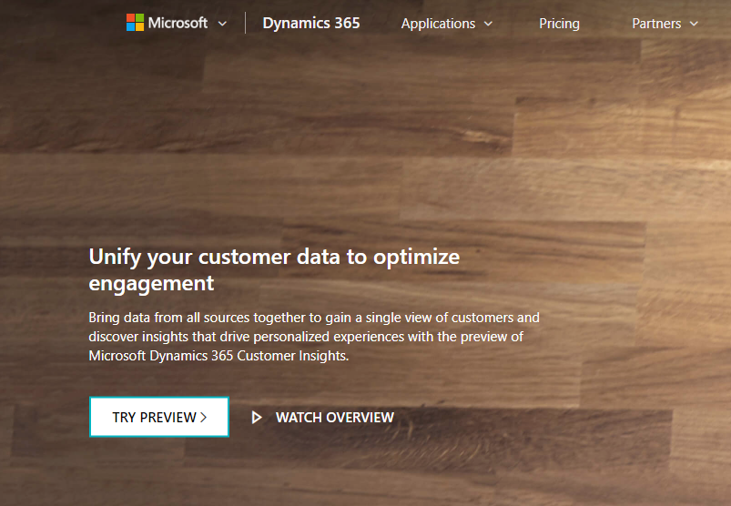
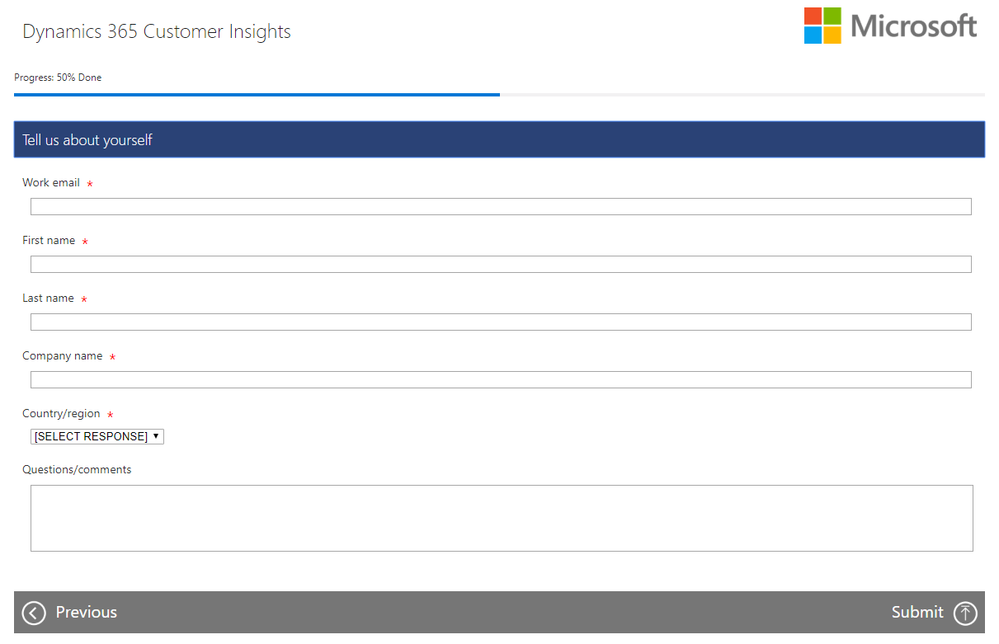
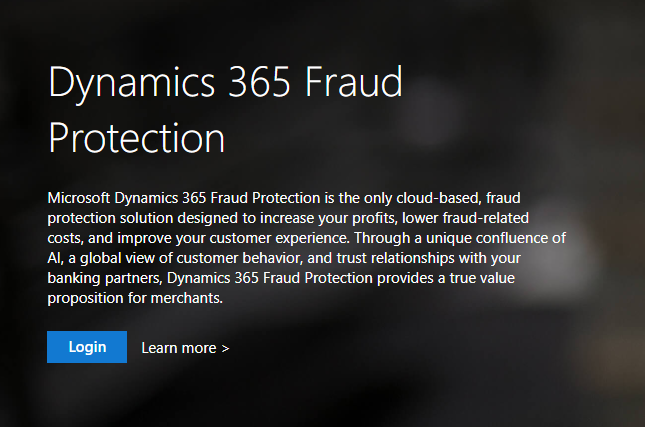

> [!NOTE]
> Dynamics 365 Fraud Protection Beta is a free service.

# Sign up for Dynamics 365 Fraud Protection

To preview Dynamics 365 Fraud Protection, from [Marketing preview page](https://dynamics.microsoft.com/en-us/ai/fraud-protection/),  select **Try Preview.**

Discover the value of Dynamics 365 Fraud Protection through a free trial and demos as to how our service can improve your bottom line. Click **Next.**

Complete your sign up form and click **Submit.**

Upon qualifying for Dynamics 365 Fraud Protection, you will recieve an email notification with a coupon code embedded in a sign-up link detailing your next steps. Select the link, and complete the steps to sign up.

## Review legal agreement

As Microsoft is committed to preserving your business, customer, and data privacy, we recommend you review the legal, privacy, and General Data Protection Regulation (GDPR) information for reassurance. Your acceptance of the terms is considered complete upon signing up for the service.

## Use coupon code to sign up with existing tenant

Using your coupon code, you can now sign up for Dynamics 365 Fraud Protection and sign into your existing tenant. If you have no tenant, you have the option to create a new one. Use the coupon code to provide access for up to 50 employees within the same tenant.

# Resource provisioning

After signing up, the Dynamics 365 Fraud Protection Diagnose portal appears. The Diagnose portal checks your status, determining whether your provisioning is complete through one of three scenarios:

- Provisioning is complete providing an array of Dynamics 365 Fraud Protection resources and links.
- Provisioning is not complete and the service automatically initiates the process displaying a progress bar.
- Provisioning is in progress and provides a work-in-process screen until provisioning is complete.

When provisioning is complete, log in to access the Diagnose portal with the login information we provide.

The Diagnose portal provides you with links and resources to begin using the service and trying out its features. Select the link in the navigation bar to access the Evaluate and Protect portal. In addition, this same link is available from the Impact report.

The provisioning service includes all the necessary resources to directly access the Evaluate and Protect portal, including the [risk engine](rules-lists.md), [fraud protection network](fraud-protection-network.md), [device fingerprinting](device-fingerprinting.md), [KPI reporting](kpi-dashboard.md), the [virtual fraud analyst](virtual-fraud-analyst.md), [transaction acceptance booster](transaction-acceptance-booster.md), and [customer support](customer-support.md). If you are not entirely provisioned, a progress bar appears showing the extent the provisioning process. 

# Dynamics 365 Fraud Protection Azure resources and merchant logins

See the following items to access the Dynamics 365 Fraud Protection Azure resources and logins.

**Admin user logins**

Username: user@merchant.onmicrosoft.com (As a new merchant, this will be updated for you)

Passwords can be set by a Global administrator in the merchant.onmicrosoft.com tenant.

**Azure tenant portal URL**

[Microsoft Azure](https://portal.azure.com/merchant.onmicrosoft.com)

- This site manages user and Azure Active Directory (AAD) application access to Dynamics 365 Fraud Protection and uploads data via the Azure Data Lake.
- We recommend you change your passwords and add two-factor authentication.

**Dynamics 365 Fraud Protection portal URL**

[Sandbox](https://dfp.microsoft-int.com/merchant.onmicrosoft.com)
[Prod](https://dfp.microsoft.com/merchant.onmicrosoft.com)

- Use these URLs to access Dynamics 365 Fraud Protection, including data, metrics, rules, and so on.
- Use the same Admin user credentials to log into the Dynamics 365 Fraud Protection portal URL.

**AAD Application so you can run Dynamics 365 Fraud Protection API**

Sandbox
- Name: DFP-Sandbox Client App
- Application Id: *appid goes here*

Prod
- Name: DFP-Prod Client App
- Application Id: *appid goes here*

**Your CustomerID to use for device fingerprinting**
- *Device fingerprinting customer (environment id) goes here*

**Azure Data Lake for you to upload your historical data**

Sandbox: DFP-Data-Upload-Sandbox
Prod: DFP-Data-Upload-Production

**API documentation**

After successfuly completing these steps, to access the API documentation, follow these steps: 
1. Navigate to [Partner API Documentation](https://apidocs.microsoft.com/services/). 
2. Scroll down and select **Sign in with the same work account you used to sign into the Azure portal to see more services. 
3. Since you have already been provisioned a tenant, use those account credentials to sign in and view the Dynamics 365 Fraud Protection API documentation.  isn’t this the same work account that they should use from #1-2?   I would restate #3 as: “Navigate to the Dynamics 365 Fraud Protection API documentation and sign in using the the same work account you used to sign into the Azure portal”
4. After signing in, select Dynamics 365 Fraud Protection API.
